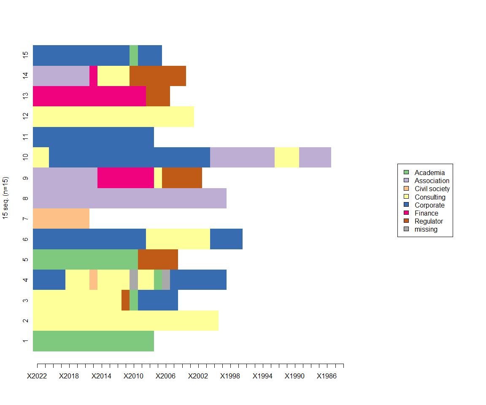
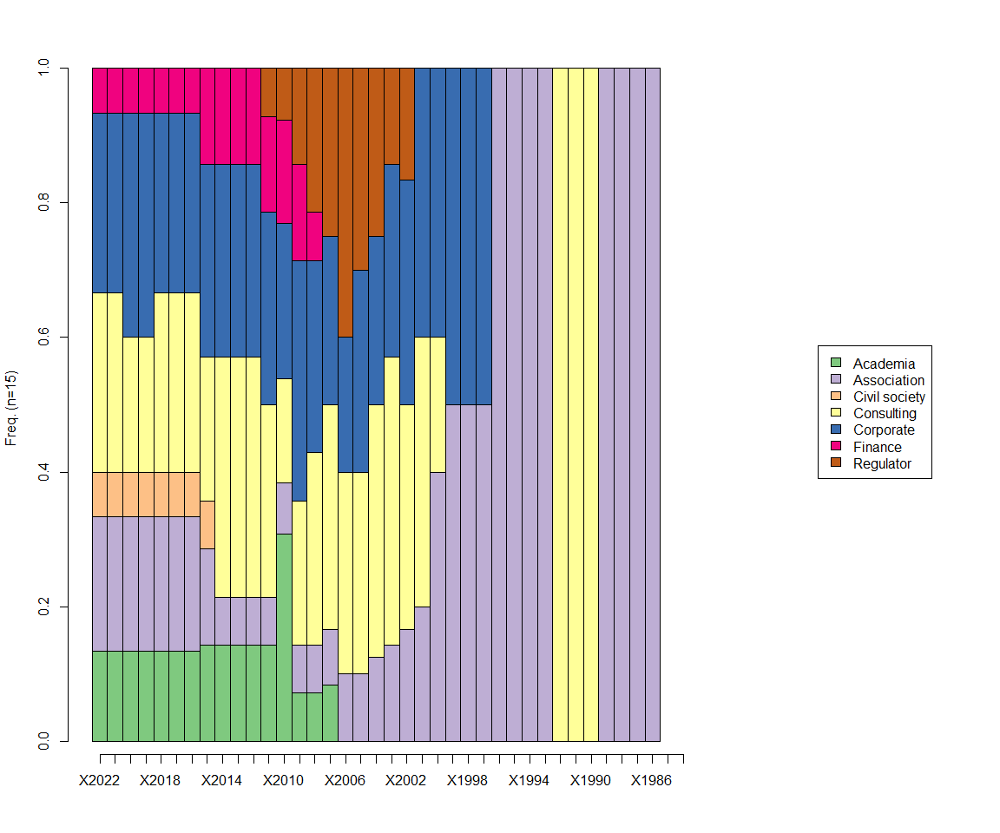
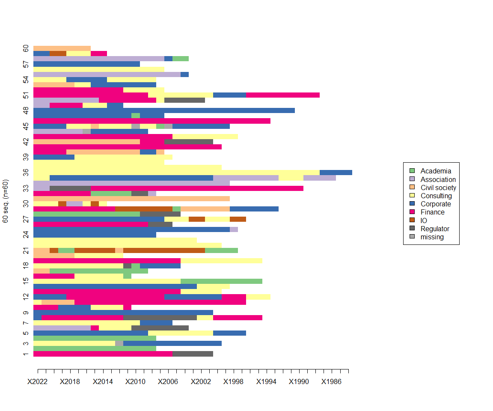
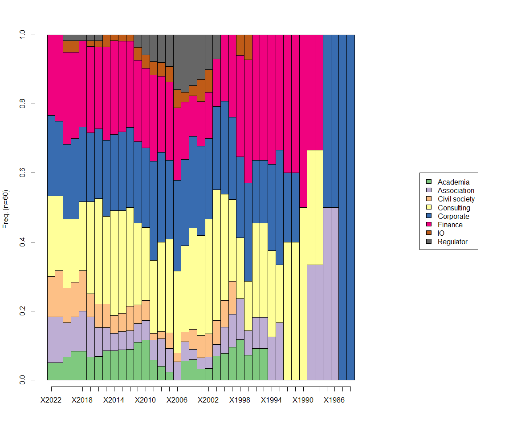
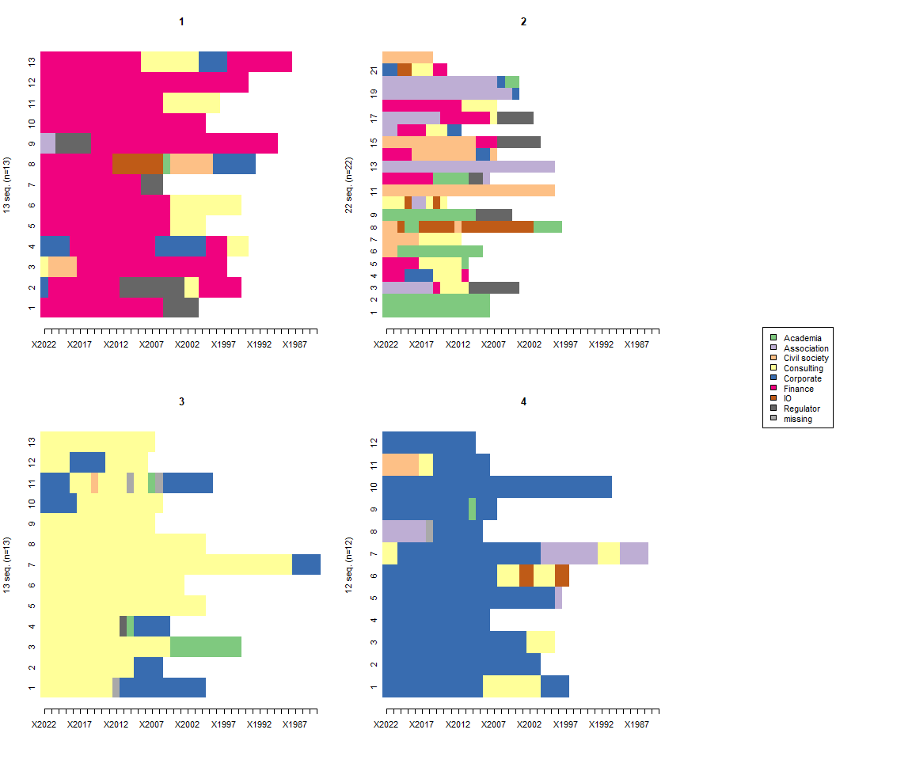

```r
knitr::opts_chunk$set(fig.width=12, fig.height=10) # we want nice and big figures to read our plot, so just setting a figure width and height as a general setting here
```

# **Sequence Analysis for the Green Transition - Intro and Case Exercise**

### The European Financial Reporting Advisory Group (EFRAG)

The European Financial Reporting Advisory Group (EFRAG) is a private association established in 2001 with the encouragement of the European Commission to serve the public interest. For two decades, the organization has brought together national and regional associations in Europe, mostly national accounting associations. 

EFRAG's main task has been to develop and promote "European views" on international accounting standards - the global rules and regulations that govern how companies account for and report on their financial activities. If you've ever seen an Annual Report or the like from a company, the information entailed is governed by international accounting standards.

NOW, EFRAG has always been a sort of "sidekick" to the REAL international accounting standard-setters, the International Accounting Standards Board (IASB) - a supposedly independent global organisation, but in practice heavily dominated by global accounting firms, in particular the "Big Four" - Deloitte, EY, KPMG and PwC. (I'm dramatizing a little bit here for effect.)

HOWEVER, the green transition has opened up a radical new opportunity for EFRAG. The European Union is preparing a new [Corporate Sustainability Reporting Directive (CSRD)](https://ec.europa.eu/info/business-economy-euro/company-reporting-and-auditing/company-reporting/corporate-sustainability-reporting_en#review), with the aim of consolidation and extending all reporting and disclosures required by companies on sustainability and climate change.

European dissatisfaction with the IASB has meant the European Commission has [specifically asked EFRAG](https://www.efrag.org/Assets/Download?assetUrl=/sites/webpublishing/SiteAssets/Letter%2520EVP%2520annexNFRD%2520%2520technical%2520mandate%25202020.pdf) to take on this issue, preparing advice and developing model rules and guidelines.

EFRAG has thus been giving a significant role in shaping the reporting and disclosure demands placed on companies operating in the European Union (and potentially beyond). To that end, EFRAG has appointed a series of [Expert Working Groups (EWGs)](https://www.efrag.org/News/Project-545/Appointed--Members-of-the-Expert-Working-Groups-to-provide-input-on-t) that will look in detail at different dimensions of the reporting.

So it's pertinent to ask: Who are these people in these EFRAG EWGs who are going to shape sustainability reporting for companies going forward? What sort of fields and networks are they part of? And what does that mean for policy-making?

That's what we'll do here.

### Loading in data

I have taken the liberty of collecting biographical information, from LinkedIn, on the 71 members of the EFRAG expert working groups (where data was available). We will load in this data, which contains name, nationality, group (EWG membership), primary education, and career data (organisational sector) for each year of each individuals' career, from 1984 (where application) to 2022.

For some, you'll see, data was not available - we'll deal with that in due course.

Some of the bibliographical data included is not relevant for the sequence analysis itself, for instance primary education or nationality, but we/you can use that to augment your analysis where relevant.

*<Maybe a brief discussion/talk on data collection and missing data, if we have time>*


```r
data = read.csv("https://raw.githubusercontent.com/phdskat/organisingglobalmarkets2022/main/efrag2022.csv",row.names=1)
```

### Looking at the data


```r
View(data)
```

### Tidyverse

To manipulate the data, we'll load `tidyverse`


```r
library(tidyverse)
```

```
## Warning: package 'tidyverse' was built under R version 4.0.5
```

```
## -- Attaching packages --------------------------------------- tidyverse 1.3.1 --
```

```
## v ggplot2 3.3.5     v purrr   0.3.4
## v tibble  3.1.6     v dplyr   1.0.7
## v tidyr   1.1.4     v stringr 1.4.0
## v readr   2.1.1     v forcats 0.5.1
```

```
## Warning: package 'ggplot2' was built under R version 4.0.5
```

```
## Warning: package 'tibble' was built under R version 4.0.5
```

```
## Warning: package 'tidyr' was built under R version 4.0.5
```

```
## Warning: package 'readr' was built under R version 4.0.5
```

```
## Warning: package 'dplyr' was built under R version 4.0.5
```

```
## Warning: package 'forcats' was built under R version 4.0.5
```

```
## -- Conflicts ------------------------------------------ tidyverse_conflicts() --
## x dplyr::filter() masks stats::filter()
## x dplyr::lag()    masks stats::lag()
```

Before we begin our sequence analysis, we'll just prepare the data we have, primarily filtering out the people for whom we don't have sequence data. We'll do that by filtering, removing any rows that don't have career information for 2022, in the "X2022" column.


```r
data <- data %>% 
  filter(X2022 != "")
```

### Sampling

For ease of analysis, we'll start with a sample of the data. So, like with the SNA data, we "slice" the data, selecting a sample of, say, 15 rows (people) to work with. For comparison's sake, we'll select the same 20 people that we can all work with. I chose these at random with the sample() function. You can play around with doing the analysis with other samples - larger samples, random samples, etc.


```r
data <- data %>% 
    slice(c(4,22,18,45,28,5,60,34,50,35,24,23,26,6,47))
```

### TraMineR

Okay, so do to our sequence analysis - to ask our analytical questions of this expert community and their professional careers - we'll use the R package `TraMineR` (Trajectory Mining for R), a toolbox for exploring sequence data. It can do all the basic things we want for our sequence analysis in R.


```r
#install.packages("TraMineR")
library(TraMineR)
```

```
## 
## TraMineR stable version 2.2-0.1 (Built: 2020-05-23)
```

```
## Website: http://traminer.unige.ch
```

```
## Please type 'citation("TraMineR")' for citation information.
```

### Defining sequences (telling TraMineR where our sequences are)

The first thing we need to do is *define* our sequences, or in other words *telling* TraMineR where our sequences are in the data, and what they look like. This is similar, for instance - if you recall, to the first operation when plotting with `ggplot`, where we define the base object we want to work with. With TraMineR, this is done with the `seqdef()` (sequence definition) function. We'll save the sequence object in a new object called 'sequences':


```r
sequences <- seqdef(data, var = 5:43, missing = "") 
```

```
##  [>] found missing values ('') in sequence data
```

```
##  [>] preparing 15 sequences
```

```
##  [>] coding void elements with '%' and missing values with '*'
```

```
##  [>] 7 distinct states appear in the data:
```

```
##      1 = Academia
```

```
##      2 = Association
```

```
##      3 = Civil society
```

```
##      4 = Consulting
```

```
##      5 = Corporate
```

```
##      6 = Finance
```

```
##      7 = Regulator
```

```
##  [>] state coding:
```

```
##        [alphabet]    [label]       [long label]
```

```
##      1  Academia      Academia      Academia
```

```
##      2  Association   Association   Association
```

```
##      3  Civil society Civil society Civil society
```

```
##      4  Consulting    Consulting    Consulting
```

```
##      5  Corporate     Corporate     Corporate
```

```
##      6  Finance       Finance       Finance
```

```
##      7  Regulator     Regulator     Regulator
```

```
##  [>] 15 sequences in the data set
```

```
##  [>] min/max sequence length: 7/37
```

```r
# the relevant variables, our career data, is in columns 5 to 43.
# it's also useful to tell the function what our missing data looks like. here, it's just "", so we'll tell it that.
```
Notice here that the `seqdef` function gives us quite a lot of information about our sequences. There are 8 distinct states (i.e. the alphabet), there are 71 sequences, the min/max lengths are 0/39. 

Good, now let's work with it.

### Viewing the raw sequences


```r
sequences
```

```
##    Sequence                                                                                                                                                                                                                                                                                                                                                                                                      
## 1  Academia-Academia-Academia-Academia-Academia-Academia-Academia-Academia-Academia-Academia-Academia-Academia-Academia-Academia-Academia                                                                                                                                                                                                                                                                        
## 2  Consulting-Consulting-Consulting-Consulting-Consulting-Consulting-Consulting-Consulting-Consulting-Consulting-Consulting-Consulting-Consulting-Consulting-Consulting-Consulting-Consulting-Consulting-Consulting-Consulting-Consulting-Consulting-Consulting                                                                                                                                                  
## 3  Consulting-Consulting-Consulting-Consulting-Consulting-Consulting-Consulting-Consulting-Consulting-Consulting-Consulting-Regulator-Academia-Corporate-Corporate-Corporate-Corporate-Corporate                                                                                                                                                                                                                 
## 4  Corporate-Corporate-Corporate-Corporate-Consulting-Consulting-Consulting-Civil society-Consulting-Consulting-Consulting-Consulting-*-Consulting-Consulting-Academia-*-Corporate-Corporate-Corporate-Corporate-Corporate-Corporate-Corporate                                                                                                                                                                   
## 5  Academia-Academia-Academia-Academia-Academia-Academia-Academia-Academia-Academia-Academia-Academia-Academia-Academia-Regulator-Regulator-Regulator-Regulator-Regulator                                                                                                                                                                                                                                        
## 6  Corporate-Corporate-Corporate-Corporate-Corporate-Corporate-Corporate-Corporate-Corporate-Corporate-Corporate-Corporate-Corporate-Corporate-Consulting-Consulting-Consulting-Consulting-Consulting-Consulting-Consulting-Consulting-Corporate-Corporate-Corporate-Corporate                                                                                                                                   
## 7  Civil society-Civil society-Civil society-Civil society-Civil society-Civil society-Civil society                                                                                                                                                                                                                                                                                                             
## 8  Association-Association-Association-Association-Association-Association-Association-Association-Association-Association-Association-Association-Association-Association-Association-Association-Association-Association-Association-Association-Association-Association-Association-Association                                                                                                               
## 9  Association-Association-Association-Association-Association-Association-Association-Association-Finance-Finance-Finance-Finance-Finance-Finance-Finance-Consulting-Regulator-Regulator-Regulator-Regulator-Regulator                                                                                                                                                                                          
## 10 Consulting-Consulting-Corporate-Corporate-Corporate-Corporate-Corporate-Corporate-Corporate-Corporate-Corporate-Corporate-Corporate-Corporate-Corporate-Corporate-Corporate-Corporate-Corporate-Corporate-Corporate-Corporate-Association-Association-Association-Association-Association-Association-Association-Association-Consulting-Consulting-Consulting-Association-Association-Association-Association
## 11 Corporate-Corporate-Corporate-Corporate-Corporate-Corporate-Corporate-Corporate-Corporate-Corporate-Corporate-Corporate-Corporate-Corporate-Corporate                                                                                                                                                                                                                                                         
## 12 Consulting-Consulting-Consulting-Consulting-Consulting-Consulting-Consulting-Consulting-Consulting-Consulting-Consulting-Consulting-Consulting-Consulting-Consulting-Consulting-Consulting-Consulting-Consulting-Consulting                                                                                                                                                                                   
## 13 Finance-Finance-Finance-Finance-Finance-Finance-Finance-Finance-Finance-Finance-Finance-Finance-Finance-Finance-Regulator-Regulator-Regulator                                                                                                                                                                                                                                                                 
## 14 Association-Association-Association-Association-Association-Association-Association-Finance-Consulting-Consulting-Consulting-Consulting-Regulator-Regulator-Regulator-Regulator-Regulator-Regulator-Regulator                                                                                                                                                                                                 
## 15 Corporate-Corporate-Corporate-Corporate-Corporate-Corporate-Corporate-Corporate-Corporate-Corporate-Corporate-Corporate-Academia-Corporate-Corporate-Corporate
```

### Overview (Index) plot

To get an overview sense at these trajectories, we'll plot them all together on an Index ("I") plot.

What can you see in terms of patterns here? What does it tell us about this community?


```r
seqIplot(sequences,with.legend="right") #we're just gonna move the legend to the right so we can have a good look
```

<!-- -->

### State distribution plot

To get a closer look at the individual sectors, and their prevalence across the years, we can plot the distribution of each state (sector) with a "d" (distribution") plot.

What can you see in terms of patterns here? What does it tell us about this community?


```r
seqdplot(sequences,with.legend="right")
```

<!-- -->

### Optimal matching

Now, remember we talked about *optimal matching*? Optimal matching is a technique that helps us find out which typical careers path there are in our community, and how they different. Optimal matching works by assessing the (dis)similarity of sequences by assigning costs to operations that would be needed to align these. Sequences can then be clustered according to similarity.

To do our optimal matching analysis, the first thing we need to calculate is the *cost* of transformation each sequence (career) into another. Thankfully, TraMineR can do this automatically by calculating the *transition rates* (trates).


```r
trates <- seqtrate(sequences)
```

```
##  [>] computing transition probabilities for states Academia/Association/Civil society/Consulting/Corporate/Finance/Regulator ...
```

```r
trates
```

```
##                    [-> Academia] [-> Association] [-> Civil society]
## [Academia ->]         0.89655172       0.00000000         0.00000000
## [Association ->]      0.00000000       0.93877551         0.00000000
## [Civil society ->]    0.00000000       0.00000000         0.85714286
## [Consulting ->]       0.01282051       0.01282051         0.01282051
## [Corporate ->]        0.01265823       0.01265823         0.00000000
## [Finance ->]          0.00000000       0.00000000         0.00000000
## [Regulator ->]        0.05882353       0.00000000         0.00000000
##                    [-> Consulting] [-> Corporate] [-> Finance] [-> Regulator]
## [Academia ->]           0.00000000     0.06896552   0.00000000     0.03448276
## [Association ->]        0.02040816     0.00000000   0.04081633     0.00000000
## [Civil society ->]      0.14285714     0.00000000   0.00000000     0.00000000
## [Consulting ->]         0.89743590     0.02564103   0.00000000     0.03846154
## [Corporate ->]          0.02531646     0.94936709   0.00000000     0.00000000
## [Finance ->]            0.09090909     0.00000000   0.86363636     0.04545455
## [Regulator ->]          0.00000000     0.00000000   0.00000000     0.94117647
```

Let's go over it. What can you see in terms of patterns here? What does it tell us about this community?

Next, we need to calculate sequence distances, based on the transition rates:


```r
distances <- seqdist(sequences, method = "OM", sm = "TRATE", with.missing= TRUE)
```

```
##  [>] including missing values as an additional state
```

```
##  [>] 15 sequences with 8 distinct states
```

```
##  [>] Computing sm with seqcost using  TRATE
```

```
##  [>] creating substitution-cost matrix using transition rates ...
```

```
##  [>] computing transition probabilities for states Academia/Association/Civil society/Consulting/Corporate/Finance/Regulator/* ...
```

```
##  [>] generated an indel of type  number
```

```
##  [>] 15 distinct  sequences
```

```
##  [>] min/max sequence lengths: 7/37
```

```
##  [>] computing distances using the OM metric
```

```
##  [>] elapsed time: 0.09 secs
```

```r
distances
```

```
##            [,1]     [,2]     [,3]     [,4]      [,5]     [,6]     [,7]     [,8]
##  [1,]  0.000000 37.81013 30.40995 36.08945  6.815686 39.81013 22.00000 39.00000
##  [2,] 37.810127  0.00000 18.69620 28.27486 40.645570 32.24051 28.91139 46.23947
##  [3,] 30.409953 18.69620  0.00000 11.79385 33.435269 19.84810 23.91139 41.57298
##  [4,] 36.089451 28.27486 11.79385  0.00000 39.114768 17.94937 28.06691 47.56316
##  [5,]  6.815686 40.64557 33.43527 39.11477  0.000000 42.77890 25.00000 42.00000
##  [6,] 39.810127 32.24051 19.84810 17.94937 42.778903  0.00000 31.91139 49.53294
##  [7,] 22.000000 28.91139 23.91139 28.06691 25.000000 31.91139  0.00000 31.00000
##  [8,] 39.000000 46.23947 41.57298 47.56316 42.000000 49.53294 31.00000  0.00000
##  [9,] 35.526557 40.90923 34.15756 42.18287 28.987342 44.26237 27.84448 28.68122
## [10,] 50.810127 49.08861 40.46498 38.51561 53.854852 26.89873 43.22242 36.74606
## [11,] 28.810127 37.24051 22.46498 16.76878 31.968776 11.00000 22.00000 38.81013
## [12,] 34.810127  3.00000 15.69620 25.33816 37.645570 29.39241 25.91139 43.33867
## [13,] 31.723529 38.61335 31.90784 40.08966 28.909091 42.27273 24.00000 40.42857
## [14,] 33.304269 33.41180 26.59399 34.61440 26.765053 36.70656 25.37794 28.82692
## [15,] 27.889451 38.22785 23.46498 17.76878 31.048101 11.92068 23.00000 39.81013
##           [,9]    [,10]    [,11]    [,12]    [,13]    [,14]    [,15]
##  [1,] 35.52656 50.81013 28.81013 34.81013 31.72353 33.30427 27.88945
##  [2,] 40.90923 49.08861 37.24051  3.00000 38.61335 33.41180 38.22785
##  [3,] 34.15756 40.46498 22.46498 15.69620 31.90784 26.59399 23.46498
##  [4,] 42.18287 38.51561 16.76878 25.33816 40.08966 34.61440 17.76878
##  [5,] 28.98734 53.85485 31.96878 37.64557 28.90909 26.76505 31.04810
##  [6,] 44.26237 26.89873 11.00000 29.39241 42.27273 36.70656 11.92068
##  [7,] 27.84448 43.22242 22.00000 25.91139 24.00000 25.37794 23.00000
##  [8,] 28.68122 36.74606 38.81013 43.33867 40.42857 28.82692 39.81013
##  [9,]  0.00000 39.81818 35.84810 37.94230 17.65492 11.72727 36.75594
## [10,] 39.81818  0.00000 22.00000 46.24051 53.17811 35.92612 22.92068
## [11,] 35.84810 22.00000  0.00000 34.24051 32.00000 33.70886  1.00000
## [12,] 37.94230 46.24051 34.24051  0.00000 35.61335 30.41180 35.22785
## [13,] 17.65492 53.17811 32.00000 35.61335  0.00000 27.25046 32.90784
## [14,] 11.72727 35.92612 33.70886 30.41180 27.25046  0.00000 34.61670
## [15,] 36.75594 22.92068  1.00000 35.22785 32.90784 34.61670  0.00000
```

### Clusters

Now we can use the `cluster` package to place our sequences into clusters, into groups, based on an agglomerative hierarchical method (agnes), with a clustering algorithm called ward. We can go into detail with this, if needed.


```r
# installing and loading the cluster package

#install.packages("cluster")
library(cluster)

# first we generate the clustering tree (agnestree)

agnestree <- agnes(distances, method = "ward")

# then we slice the tree into a specified number of clusters, let's try with 3 first, but you can try different cluster solutions - could also be 2,3,5,6, etc.

clusters <- cutree(agnestree, k = 3)
```

### Viewing clusters

And now, with TraMineR, we can view our clusters on an Index ("I") plot: 


```r
seqIplot(sequences, group = clusters, with.legend = "right")
```

<!-- -->

Let's go over it. What can you see in terms of patterns here? What does it tell us about this community?

# **Case Exercise**

Now for the exercise, you'll use the full sample of people involved in EFRAG sustainability reporting standard-setting. With that, we have a fuller picture.

These exercises you will run yourself in smaller groups, and then we will come back to discussion points outlined at the end of the document.

### Loading in the full data - we also filter out those without any career information here to start.


```r
data = read.csv("https://raw.githubusercontent.com/phdskat/organisingglobalmarkets2022/main/efrag2022.csv",row.names=1) %>% 
  filter(X2022 != "")
```

### Defining sequences 


```r
sequences <- seqdef(data, var = 5:43, missing = "") 
```

```
##  [>] found missing values ('') in sequence data
```

```
##  [>] preparing 60 sequences
```

```
##  [>] coding void elements with '%' and missing values with '*'
```

```
##  [>] 8 distinct states appear in the data:
```

```
##      1 = Academia
```

```
##      2 = Association
```

```
##      3 = Civil society
```

```
##      4 = Consulting
```

```
##      5 = Corporate
```

```
##      6 = Finance
```

```
##      7 = IO
```

```
##      8 = Regulator
```

```
##  [>] state coding:
```

```
##        [alphabet]    [label]       [long label]
```

```
##      1  Academia      Academia      Academia
```

```
##      2  Association   Association   Association
```

```
##      3  Civil society Civil society Civil society
```

```
##      4  Consulting    Consulting    Consulting
```

```
##      5  Corporate     Corporate     Corporate
```

```
##      6  Finance       Finance       Finance
```

```
##      7  IO            IO            IO
```

```
##      8  Regulator     Regulator     Regulator
```

```
##  [>] 60 sequences in the data set
```

```
##  [>] min/max sequence length: 7/39
```

### Viewing the raw sequences


```r
sequences
```

```
##    Sequence                                                                                                                                                                                                                                                                                                                                                                                                                                
## 1  Finance-Finance-Finance-Finance-Finance-Finance-Finance-Finance-Finance-Finance-Finance-Finance-Finance-Finance-Finance-Finance-Finance-Regulator-Regulator-Regulator-Regulator-Regulator                                                                                                                                                                                                                                               
## 2  Academia-Academia-Academia-Academia-Academia-Academia-Academia-Academia-Academia-Academia-Academia-Academia-Academia-Academia-Academia                                                                                                                                                                                                                                                                                                  
## 3  Consulting-Consulting-Consulting-Consulting-Consulting-Consulting-Consulting-Consulting-Consulting-Consulting-*-Corporate-Corporate-Corporate-Corporate-Corporate-Corporate-Corporate-Corporate-Corporate-Corporate-Corporate-Corporate                                                                                                                                                                                                 
## 4  Academia-Academia-Academia-Academia-Academia-Academia-Academia-Academia-Academia-Academia-Academia-Academia-Academia-Academia-Academia                                                                                                                                                                                                                                                                                                  
## 5  Corporate-Corporate-Corporate-Corporate-Corporate-Corporate-Corporate-Corporate-Corporate-Corporate-Corporate-Corporate-Corporate-Corporate-Consulting-Consulting-Consulting-Consulting-Consulting-Consulting-Consulting-Consulting-Corporate-Corporate-Corporate-Corporate                                                                                                                                                             
## 6  Association-Association-Association-Association-Association-Association-Association-Finance-Consulting-Consulting-Consulting-Consulting-Regulator-Regulator-Regulator-Regulator-Regulator-Regulator-Regulator                                                                                                                                                                                                                           
## 7  Consulting-Consulting-Consulting-Consulting-Consulting-Consulting-Consulting-Consulting-Consulting-Consulting-Consulting-Consulting-Consulting-Corporate-Corporate-Corporate-Corporate                                                                                                                                                                                                                                                  
## 8  Corporate-Finance-Finance-Finance-Finance-Finance-Finance-Finance-Finance-Finance-Finance-Regulator-Regulator-Regulator-Regulator-Regulator-Regulator-Regulator-Regulator-Regulator-Consulting-Consulting-Finance-Finance-Finance-Finance-Finance-Finance                                                                                                                                                                               
## 9  Corporate-Corporate-Corporate-Corporate-Corporate-Corporate-Corporate-Corporate-Corporate-Corporate-Corporate-Corporate-Corporate-Corporate-Corporate-Corporate-Corporate-Corporate-Corporate-Corporate-Corporate-Corporate                                                                                                                                                                                                             
## 10 Finance-Finance-Finance-Corporate-Corporate-Corporate-Corporate-Consulting-Consulting-Consulting-Consulting-Finance                                                                                                                                                                                                                                                                                                                     
## 11 Consulting-Civil society-Civil society-Civil society-Civil society-Finance-Finance-Finance-Finance-Finance-Finance-Finance-Finance-Finance-Finance-Finance-Finance-Finance-Finance-Finance-Finance-Finance-Finance-Finance-Finance-Finance                                                                                                                                                                                              
## 12 Corporate-Corporate-Corporate-Corporate-Finance-Finance-Finance-Finance-Finance-Finance-Finance-Finance-Finance-Finance-Finance-Finance-Corporate-Corporate-Corporate-Corporate-Corporate-Corporate-Corporate-Finance-Finance-Finance-Consulting-Consulting-Consulting                                                                                                                                                                  
## 13 Finance-Finance-Finance-Finance-Finance-Finance-Finance-Finance-Finance-Finance-Finance-Finance-Finance-Finance-Finance-Finance-Finance-Finance-Consulting-Consulting-Consulting-Consulting-Consulting                                                                                                                                                                                                                                  
## 14 Corporate-Corporate-Corporate-Corporate-Corporate-Corporate-Corporate-Corporate-Corporate-Corporate-Corporate-Corporate-Corporate-Corporate-Corporate-Corporate-Corporate-Corporate-Corporate-Corporate-Consulting-Consulting-Consulting-Consulting                                                                                                                                                                                     
## 15 Consulting-Consulting-Consulting-Consulting-Consulting-Consulting-Consulting-Consulting-Consulting-Consulting-Consulting-Consulting-Consulting-Consulting-Consulting-Consulting-Consulting-Consulting-Academia-Academia-Academia-Academia-Academia-Academia-Academia-Academia-Academia-Academia                                                                                                                                         
## 16 Finance-Finance-Finance-Finance-Finance-Consulting-Consulting-Consulting-Consulting-Consulting-Consulting-Academia                                                                                                                                                                                                                                                                                                                      
## 17 Civil society-Civil society-Academia-Academia-Academia-Academia-Academia-Academia-Academia-Academia-Academia-Academia-Academia-Academia                                                                                                                                                                                                                                                                                                 
## 18 Consulting-Consulting-Consulting-Consulting-Consulting-Consulting-Consulting-Consulting-Consulting-Consulting-Consulting-Regulator-Academia-Corporate-Corporate-Corporate-Corporate-Corporate                                                                                                                                                                                                                                           
## 19 Finance-Finance-Finance-Finance-Finance-Finance-Finance-Finance-Finance-Finance-Finance-Finance-Finance-Finance-Finance-Finance-Finance-Finance-Consulting-Consulting-Consulting-Consulting-Consulting-Consulting-Consulting-Consulting-Consulting-Consulting                                                                                                                                                                           
## 20 Civil society-Civil society-Civil society-Civil society-Civil society-Consulting-Consulting-Consulting-Consulting-Consulting-Consulting                                                                                                                                                                                                                                                                                                 
## 21 Civil society-Civil society-IO-Academia-Academia-IO-IO-IO-IO-IO-Civil society-IO-IO-IO-IO-IO-IO-IO-IO-IO-IO-Academia-Academia-Academia-Academia                                                                                                                                                                                                                                                                                         
## 22 Consulting-Consulting-Consulting-Consulting-Consulting-Consulting-Consulting-Consulting-Consulting-Consulting-Consulting-Consulting-Consulting-Consulting-Consulting-Consulting-Consulting-Consulting-Consulting-Consulting-Consulting-Consulting-Consulting                                                                                                                                                                            
## 23 Consulting-Consulting-Consulting-Consulting-Consulting-Consulting-Consulting-Consulting-Consulting-Consulting-Consulting-Consulting-Consulting-Consulting-Consulting-Consulting-Consulting-Consulting-Consulting-Consulting                                                                                                                                                                                                             
## 24 Corporate-Corporate-Corporate-Corporate-Corporate-Corporate-Corporate-Corporate-Corporate-Corporate-Corporate-Corporate-Corporate-Corporate-Corporate                                                                                                                                                                                                                                                                                   
## 25 Corporate-Corporate-Corporate-Corporate-Corporate-Corporate-Corporate-Corporate-Corporate-Corporate-Corporate-Corporate-Corporate-Corporate-Corporate-Corporate-Corporate-Corporate-Corporate-Corporate-Corporate-Corporate-Corporate-Corporate-Association                                                                                                                                                                             
## 26 Finance-Finance-Finance-Finance-Finance-Finance-Finance-Finance-Finance-Finance-Finance-Finance-Finance-Finance-Regulator-Regulator-Regulator                                                                                                                                                                                                                                                                                           
## 27 Corporate-Corporate-Corporate-Corporate-Corporate-Corporate-Corporate-Corporate-Corporate-Corporate-Corporate-Corporate-Corporate-Corporate-Corporate-Corporate-Consulting-Consulting-Consulting-IO-IO-Consulting-Consulting-Consulting-IO-IO                                                                                                                                                                                           
## 28 Academia-Academia-Academia-Academia-Academia-Academia-Academia-Academia-Academia-Academia-Academia-Academia-Academia-Regulator-Regulator-Regulator-Regulator-Regulator                                                                                                                                                                                                                                                                  
## 29 Finance-Finance-Finance-Finance-Finance-Finance-Finance-Finance-Finance-Finance-IO-IO-IO-IO-IO-IO-IO-Academia-Civil society-Civil society-Civil society-Civil society-Civil society-Civil society-Corporate-Corporate-Corporate-Corporate-Corporate-Corporate                                                                                                                                                                           
## 30 Consulting-Consulting-Consulting-IO-Association-Association-Consulting-IO-Consulting                                                                                                                                                                                                                                                                                                                                                    
## 31 Civil society-Civil society-Civil society-Civil society-Civil society-Civil society-Civil society-Civil society-Civil society-Civil society-Civil society-Civil society-Civil society-Civil society-Civil society-Civil society-Civil society-Civil society-Civil society-Civil society-Civil society-Civil society-Civil society-Civil society                                                                                         
## 32 Finance-Finance-Finance-Finance-Finance-Finance-Finance-Academia-Academia-Academia-Academia-Academia-Regulator-Regulator-Association                                                                                                                                                                                                                                                                                                    
## 33 Association-Association-Regulator-Regulator-Regulator-Regulator-Regulator-Finance-Finance-Finance-Finance-Finance-Finance-Finance-Finance-Finance-Finance-Finance-Finance-Finance-Finance-Finance-Finance-Finance-Finance-Finance-Finance-Finance-Finance-Finance-Finance-Finance-Finance                                                                                                                                               
## 34 Association-Association-Association-Association-Association-Association-Association-Association-Association-Association-Association-Association-Association-Association-Association-Association-Association-Association-Association-Association-Association-Association-Association-Association                                                                                                                                         
## 35 Consulting-Consulting-Corporate-Corporate-Corporate-Corporate-Corporate-Corporate-Corporate-Corporate-Corporate-Corporate-Corporate-Corporate-Corporate-Corporate-Corporate-Corporate-Corporate-Corporate-Corporate-Corporate-Association-Association-Association-Association-Association-Association-Association-Association-Consulting-Consulting-Consulting-Association-Association-Association-Association                          
## 36 Consulting-Consulting-Consulting-Consulting-Consulting-Consulting-Consulting-Consulting-Consulting-Consulting-Consulting-Consulting-Consulting-Consulting-Consulting-Consulting-Consulting-Consulting-Consulting-Consulting-Consulting-Consulting-Consulting-Consulting-Consulting-Consulting-Consulting-Consulting-Consulting-Consulting-Consulting-Consulting-Consulting-Consulting-Consulting-Corporate-Corporate-Corporate-Corporate
## 37 Consulting-Consulting-Consulting-Consulting-Consulting-Consulting-Consulting-Consulting-Consulting-Consulting-Consulting-Consulting-Consulting-Consulting-Consulting-Consulting-Consulting-Consulting-Consulting-Consulting-Consulting-Consulting-Consulting                                                                                                                                                                            
## 38 Consulting-Consulting-Consulting-Consulting-Consulting-Consulting-Consulting-Consulting-Consulting-Consulting-Consulting-Consulting-Consulting-Consulting-Consulting-Consulting                                                                                                                                                                                                                                                         
## 39 Corporate-Corporate-Corporate-Corporate-Corporate-Consulting-Consulting-Consulting-Consulting-Consulting-Consulting-Consulting-Consulting-Consulting-Consulting-Consulting-Consulting                                                                                                                                                                                                                                                   
## 40 Finance-Finance-Finance-Finance-Civil society-Civil society-Civil society-Civil society-Civil society-Civil society-Civil society-Civil society-Civil society-Corporate-Corporate-Civil society                                                                                                                                                                                                                                         
## 41 Finance-Finance-Finance-Finance-Finance-Finance-Finance-Finance-Finance-Finance-Finance-Finance-Finance-Finance-Finance-Finance-Finance-Finance-Finance-Finance-Finance-Finance-Finance                                                                                                                                                                                                                                                 
## 42 Civil society-Civil society-Civil society-Civil society-Civil society-Civil society-Civil society-Civil society-Civil society-Civil society-Civil society-Civil society-Civil society-Finance-Finance-Finance-Regulator-Regulator-Regulator-Regulator-Regulator-Regulator                                                                                                                                                               
## 43 Finance-Finance-Finance-Finance-Finance-Finance-Finance-Finance-Finance-Finance-Finance-Finance-Finance-Finance-Finance-Finance-Finance-Consulting-Consulting-Consulting-Consulting-Consulting-Consulting-Consulting-Consulting                                                                                                                                                                                                         
## 44 Association-Association-Association-Association-Association-Association-*-Corporate-Corporate-Corporate-Corporate-Corporate-Corporate-Corporate                                                                                                                                                                                                                                                                                         
## 45 Corporate-Corporate-Corporate-Corporate-Consulting-Consulting-Consulting-Civil society-Consulting-Consulting-Consulting-Consulting-*-Consulting-Consulting-Academia-*-Corporate-Corporate-Corporate-Corporate-Corporate-Corporate-Corporate                                                                                                                                                                                             
## 46 Finance-Finance-Finance-Finance-Finance-Finance-Finance-Finance-Finance-Finance-Finance-Finance-Finance-Finance-Finance-Finance-Finance-Finance-Finance-Finance-Finance-Finance-Finance-Finance-Finance-Finance-Finance-Finance-Finance                                                                                                                                                                                                 
## 47 Corporate-Corporate-Corporate-Corporate-Corporate-Corporate-Corporate-Corporate-Corporate-Corporate-Corporate-Corporate-Academia-Corporate-Corporate-Corporate                                                                                                                                                                                                                                                                          
## 48 Corporate-Corporate-Corporate-Corporate-Corporate-Corporate-Corporate-Corporate-Corporate-Corporate-Corporate-Corporate-Corporate-Corporate-Corporate-Corporate-Corporate-Corporate-Corporate-Corporate-Corporate-Corporate-Corporate-Corporate-Corporate-Corporate-Corporate-Corporate-Corporate-Corporate-Corporate-Corporate                                                                                                         
## 49 Association-Association-Finance-Finance-Finance-Finance-Consulting-Consulting-Consulting-Corporate-Corporate                                                                                                                                                                                                                                                                                                                            
## 50 Association-Association-Association-Association-Association-Association-Association-Association-Finance-Finance-Finance-Finance-Finance-Finance-Finance-Consulting-Regulator-Regulator-Regulator-Regulator-Regulator                                                                                                                                                                                                                    
## 51 Finance-Finance-Finance-Finance-Finance-Finance-Finance-Finance-Finance-Finance-Finance-Finance-Finance-Finance-Consulting-Consulting-Consulting-Consulting-Consulting-Consulting-Consulting-Consulting-Corporate-Corporate-Corporate-Corporate-Finance-Finance-Finance-Finance-Finance-Finance-Finance-Finance-Finance                                                                                                                 
## 52 Finance-Finance-Finance-Finance-Finance-Finance-Finance-Finance-Finance-Finance-Finance-Consulting-Consulting-Consulting-Consulting-Consulting                                                                                                                                                                                                                                                                                          
## 53 Civil society-Civil society-Civil society-Civil society-Civil society-Consulting-Consulting-Corporate-Corporate-Corporate-Corporate-Corporate-Corporate-Corporate-Corporate                                                                                                                                                                                                                                                             
## 54 Consulting-Consulting-Consulting-Consulting-Corporate-Corporate-Corporate-Corporate-Corporate-Consulting-Consulting-Consulting-Consulting-Consulting-Consulting                                                                                                                                                                                                                                                                         
## 55 Association-Association-Association-Association-Association-Association-Association-Association-Association-Association-Association-Association-Association-Association-Association-Association-Association-Association-Corporate                                                                                                                                                                                                       
## 56 Consulting-Consulting-Consulting-Consulting-Consulting-Consulting-Consulting-Consulting-Consulting-Consulting-Consulting-Consulting-Consulting-Consulting-Consulting-Consulting                                                                                                                                                                                                                                                         
## 57 Corporate-Corporate-Corporate-Corporate-Corporate-Corporate-Corporate-Corporate-Corporate-Corporate-Corporate-Corporate-Corporate                                                                                                                                                                                                                                                                                                       
## 58 Association-Association-Association-Association-Association-Association-Association-Association-Association-Association-Association-Association-Association-Association-Association-Association-Corporate-Academia-Academia                                                                                                                                                                                                             
## 59 Corporate-Corporate-IO-IO-Consulting-Consulting-Consulting-Finance-Finance                                                                                                                                                                                                                                                                                                                                                              
## 60 Civil society-Civil society-Civil society-Civil society-Civil society-Civil society-Civil society
```

### Overview (Index) plot


```r
seqIplot(sequences,with.legend="right") #we're just gonna move the legend to the right so we can have a good look
```

<!-- -->

### State distribution plot


```r
seqdplot(sequences,with.legend="right")
```

<!-- -->

### Optimal matching


```r
trates <- seqtrate(sequences)
```

```
##  [>] computing transition probabilities for states Academia/Association/Civil society/Consulting/Corporate/Finance/IO/Regulator ...
```

```r
trates
```

```
##                    [-> Academia] [-> Association] [-> Civil society]
## [Academia ->]        0.920000000      0.000000000        0.013333333
## [Association ->]     0.000000000      0.914893617        0.000000000
## [Civil society ->]   0.012987013      0.000000000        0.870129870
## [Consulting ->]      0.010067114      0.003355705        0.006711409
## [Corporate ->]       0.007299270      0.007299270        0.003649635
## [Finance ->]         0.003484321      0.000000000        0.003484321
## [IO ->]              0.100000000      0.033333333        0.033333333
## [Regulator ->]       0.023809524      0.023809524        0.000000000
##                    [-> Consulting] [-> Corporate] [-> Finance]     [-> IO]
## [Academia ->]           0.00000000    0.026666667   0.00000000 0.013333333
## [Association ->]        0.02127660    0.021276596   0.03191489 0.000000000
## [Civil society ->]      0.03896104    0.025974026   0.02597403 0.025974026
## [Consulting ->]         0.91946309    0.026845638   0.01006711 0.013422819
## [Corporate ->]          0.02554745    0.937956204   0.01459854 0.003649635
## [Finance ->]            0.03484321    0.006968641   0.93379791 0.003484321
## [IO ->]                 0.10000000    0.000000000   0.00000000 0.733333333
## [Regulator ->]          0.02380952    0.000000000   0.02380952 0.000000000
##                    [-> Regulator]
## [Academia ->]          0.02666667
## [Association ->]       0.01063830
## [Civil society ->]     0.00000000
## [Consulting ->]        0.01006711
## [Corporate ->]         0.00000000
## [Finance ->]           0.01393728
## [IO ->]                0.00000000
## [Regulator ->]         0.90476190
```

Calculating sequence distances, based on the transition rates:


```r
distances <- seqdist(sequences, method = "OM", sm = "TRATE", with.missing= TRUE)
```

```
##  [>] including missing values as an additional state
```

```
##  [>] 60 sequences with 9 distinct states
```

```
##  [>] Computing sm with seqcost using  TRATE
```

```
##  [>] creating substitution-cost matrix using transition rates ...
```

```
##  [>] computing transition probabilities for states Academia/Association/Civil society/Consulting/Corporate/Finance/IO/Regulator/* ...
```

```
##  [>] generated an indel of type  number
```

```
##  [>] 57 distinct  sequences
```

```
##  [>] min/max sequence lengths: 7/39
```

```
##  [>] computing distances using the OM metric
```

```
##  [>] elapsed time: 0.11 secs
```

```r
distances
```

```
##           [,1]      [,2]     [,3]      [,4]     [,5]     [,6]      [,7]
##  [1,]  0.00000 36.714530 44.40060 36.714530 47.39448 28.52408 38.330770
##  [2,] 36.71453  0.000000 37.56662  0.000000 40.49577 33.60564 31.755540
##  [3,] 44.40060 37.566619  0.00000 37.566619 24.68672 33.78611 11.843358
##  [4,] 36.71453  0.000000 37.56662  0.000000 40.49577 33.60564 31.755540
##  [5,] 47.39448 40.495774 24.68672 40.495774  0.00000 36.64473 18.738929
##  [6,] 28.52408 33.605638 33.78611 33.605638 36.64473  0.00000 27.694104
##  [7,] 38.33077 31.755540 11.84336 31.755540 18.73893 27.69410  0.000000
##  [8,] 17.95516 42.484804 46.50448 42.484804 47.47313 30.61384 40.413085
##  [9,] 43.63336 36.495774 20.47786 36.495774 11.79114 40.57111 30.321217
## [10,] 25.73436 26.811602 26.63505 26.811602 21.89046 20.89910 20.611771
## [11,] 13.84901 40.850577 46.33447 40.850577 49.59669 42.33535 40.372475
## [12,] 20.85544 43.596750 29.94779 43.596750 26.80077 39.72673 37.365442
## [13,] 10.82702 37.915157 35.77578 37.915157 38.56353 31.74514 29.641254
## [14,] 45.49812 38.495774 22.58229 38.495774 13.79114 34.77997 32.321217
## [15,] 48.98704 22.950000 30.44783 22.950000 37.34340 38.43358 18.791144
## [16,] 23.68082 24.922578 22.78701 24.922578 25.81200 20.75594 16.742169
## [17,] 35.66607  4.947710 36.50536  4.947710 39.53737 32.53787 30.694284
## [18,] 37.45660 30.701799 10.91417 30.701799 19.84336 26.71160  4.913976
## [19,] 15.82702 42.882578 31.00000 42.882578 37.59363 36.57609 24.865470
## [20,] 32.58365 25.809275 21.81749 25.809275 24.81987 21.90292 15.771861
## [21,] 46.66234 26.981579 46.71031 26.981579 49.77357 43.10935 40.392206
## [22,] 44.06862 37.850000 25.37343 37.850000 32.21679 33.54779 13.791144
## [23,] 41.13624 34.850000 22.47786 34.850000 29.37343 30.54779 10.791144
## [24,] 36.67649 29.495774 13.84336 29.495774 11.00000 33.57111 23.425645
## [25,] 46.59902 39.495774 23.47786 39.495774 14.68672 41.82989 33.321217
## [26,]  5.00000 31.807812 39.46530 31.807812 42.48025 27.51175 33.395471
## [27,] 47.44103 40.177603 24.79114 40.177603 11.76603 36.71235 30.390024
## [28,] 29.95470  6.899749 40.58662  6.899749 43.39396 26.85627 34.750952
## [29,] 31.80168 41.980059 39.89040 41.980059 43.68081 46.27549 37.919728
## [30,] 30.70566 23.723684 21.72456 23.723684 24.74895 19.78018 15.724561
## [31,] 45.49921 38.607826 46.18824 38.607826 49.16100 42.78803 40.288345
## [32,] 18.84266 19.875359 37.48967 19.875359 40.54164 27.50684 31.536900
## [33,] 20.81127 47.714530 55.29276 47.714530 58.23948 37.92451 49.330770
## [34,] 45.29148 39.000000 46.41592 39.000000 49.34335 28.63053 40.569575
## [35,] 58.28901 51.495774 31.58229 51.495774 26.89557 35.83108 41.425645
## [36,] 60.06862 53.755540 33.58229 53.755540 40.26900 49.54779 22.000000
## [37,] 44.06862 37.850000 25.37343 37.850000 32.21679 33.54779 13.791144
## [38,] 37.28251 30.850000 18.68672 30.850000 25.58229 26.62095  6.843358
## [39,] 38.35405 31.731925 19.89557 31.731925 16.79114 27.57673  9.947786
## [40,] 29.66228 30.660868 34.42837 30.660868 37.48946 32.70958 28.380354
## [41,] 10.81127 37.947735 45.29276 37.947735 48.31775 39.33535 39.330770
## [42,] 27.57929 36.463944 44.39015 36.463944 47.30078 26.91031 38.342138
## [43,] 12.83095 39.895610 31.91031 39.895610 34.69806 33.64371 25.775784
## [44,] 35.65956 28.764695 20.85368 28.764695 25.82989 20.74122 22.697042
## [45,] 45.41598 36.584089 12.94779 36.584089 17.94779 34.65639 14.791144
## [46,] 16.81127 43.947735 51.29276 43.947735 54.25305 45.33535 45.330770
## [47,] 37.67301 28.529389 14.84336 28.529389 11.96638 34.52099 24.425645
## [48,] 53.63336 46.495774 30.47786 46.495774 21.58229 50.57111 40.321217
## [49,] 24.75918 25.888833 23.77186 25.888833 26.76392 17.85305 17.771855
## [50,] 18.70253 35.714983 41.61848 35.714983 44.40661 11.86547 35.517050
## [51,] 22.81127 49.775087 33.73778 49.775087 36.69806 43.51472 27.775784
## [52,] 15.77578 30.915157 28.77578 30.915157 31.69293 24.74514 22.641254
## [53,] 36.59048 29.580355 17.77186 29.580355 24.74745 29.86611 19.563005
## [54,] 36.44373 29.731925 18.00000 29.731925 18.79114 25.72425 11.843358
## [55,] 40.41779 33.966385 39.51743 33.966385 42.49363 23.65491 33.597927
## [56,] 37.28251 30.850000 18.68672 30.850000 25.58229 26.62095  6.843358
## [57,] 34.71963 27.563004 11.94779 27.563004 13.00000 31.57111 21.530073
## [58,] 40.37292 29.966385 39.50690 29.966385 42.48311 23.62333 33.587400
## [59,] 26.81537 23.669485 25.57922 23.669485 24.68365 21.72114 19.579219
## [60,] 28.79379 21.816986 29.68061 21.816986 32.68061 25.78803 23.680606
##           [,8]      [,9]     [,10]     [,11]    [,12]     [,13]     [,14]
##  [1,] 17.95516 43.633358 25.734358 13.849013 20.85544 10.827015 45.498120
##  [2,] 42.48480 36.495774 26.811602 40.850577 43.59675 37.915157 38.495774
##  [3,] 46.50448 20.477859 26.635047 46.334467 29.94779 35.775784 22.582287
##  [4,] 42.48480 36.495774 26.811602 40.850577 43.59675 37.915157 38.495774
##  [5,] 47.47313 11.791144 21.890455 49.596691 26.80077 38.563530 13.791144
##  [6,] 30.61384 40.571113 20.899095 42.335347 39.72673 31.745138 34.779970
##  [7,] 40.41309 30.321217 20.611771 40.372475 37.36544 29.641254 32.321217
##  [8,]  0.00000 47.550497 27.824045 21.744859 24.95516 18.910314 45.694642
##  [9,] 47.55050  0.000000 25.704875 47.462649 28.67082 44.372287  5.895572
## [10,] 27.82404 25.704875  0.000000 29.734358 20.94779 20.868888 19.935298
## [11,] 21.74486 47.462649 29.734358  0.000000 24.65968 12.865470 47.863117
## [12,] 24.95516 28.670820 20.947786 24.659684  0.00000 15.935298 24.761052
## [13,] 18.91031 44.372287 20.868888 12.865470 15.93530  0.000000 38.559577
## [14,] 45.69464  5.895572 19.935298 47.863117 24.76105 38.559577  0.000000
## [15,] 51.27165 48.925686 31.611771 51.206653 50.24627 40.417038 43.269002
## [16,] 25.81714 33.545264  9.848953 27.727456 24.84336 14.955157 27.787736
## [17,] 41.46631 35.537372 25.759654 35.912867 42.60822 36.866693 37.537372
## [18,] 41.44346 29.392030 21.618867 41.399363 36.40588 30.730941 31.392030
## [19,] 23.91031 49.219053 25.746300 17.865470 20.93530  5.000000 43.384775
## [20,] 34.67317 32.538597 14.747949 28.685313 33.69524 23.807865 26.747453
## [21,] 52.56364 46.661993 36.380278 44.891912 53.46110 47.299662 48.346770
## [22,] 46.09506 43.851290 26.611771 46.010311 45.02206 35.192822 38.007932
## [23,] 43.19649 40.955718 23.611771 43.144841 42.15659 32.327352 35.164574
## [24,] 40.63677  7.000000 18.704875 40.613619 21.82179 37.523258  9.000000
## [25,] 50.54049  3.000000 28.694863 50.387936 31.62769 47.350720  8.791144
## [26,] 16.92451 38.698059 20.734358 14.886760 17.89463 11.886760 40.573355
## [27,] 47.59799 15.686715 21.890455 49.648632 26.75763 38.610082  9.895572
## [28,] 35.73801 39.563004 29.682102 43.668812 46.44241 40.765970 41.427766
## [29,] 37.59658 39.594538 27.895572 35.715414 26.91146 32.426365 41.637673
## [30,] 32.78594 30.674926 12.947786 32.693109 31.89557 22.000000 24.947786
## [31,] 51.40779 45.348279 35.581161 41.394664 52.24267 46.241611 47.225016
## [32,] 24.71504 36.652603 18.865470 26.875506 29.72485 23.875506 38.588949
## [33,] 28.57999 54.511953 36.734358 16.837323 31.63623 19.775784 56.375714
## [34,] 51.21729 45.376258 35.662733 49.312456 52.27115 46.309649 47.335418
## [35,] 58.33848 18.895572 34.804953 60.222621 37.71116 50.000000 14.975614
## [36,] 61.92601 52.060146 42.611771 61.875782 59.09638 51.192822 53.955718
## [37,] 46.09506 43.851290 26.611771 46.010311 45.02206 35.192822 38.007932
## [38,] 39.36482 37.164574 19.611771 39.324214 38.33596 28.506725 31.373431
## [39,] 38.46530 28.373431 12.933590 40.503587 29.55219 29.578262 22.582287
## [40,] 35.62994 33.617495 17.895125 33.662282 32.68842 30.552480 35.601491
## [41,] 18.72158 44.525522 26.734358  6.925698 21.75763  9.775784 46.410851
## [42,] 31.76417 43.550191 27.827015 33.492225 44.40171 38.406310 45.414953
## [43,] 20.95516 46.280347 22.776947 16.820627 17.95687  3.955157 40.446069
## [44,] 39.80930 21.829889 17.748621 39.659556 28.81053 36.506321 23.829889
## [45,] 45.47357 23.466834 19.955157 45.484446 30.56347 36.704900 25.530073
## [46,] 24.54903 50.525522 32.734358 12.837323 27.62823 15.775784 52.389284
## [47,] 41.60821  7.966385 19.704875 41.610135 22.81831 38.523258  9.966385
## [48,] 57.55050 10.000000 35.704875 57.376380 38.51985 54.350720 15.791144
## [49,] 26.84886 28.700385 10.904652 28.759178 25.93684 19.832414 28.804813
## [50,] 24.84310 42.570000 24.774556 32.513791 33.67975 27.612130 42.520786
## [51,] 26.66234 48.366615 30.791144 18.925698 25.66569 19.865470 50.230377
## [52,] 19.82772 37.501690 13.868888 19.775784 16.89557  7.000000 31.710547
## [53,] 38.72314 20.747453 18.671999 32.692148 27.86595 33.696066 22.747453
## [54,] 36.73436 26.477859 10.820627 38.478165 27.64187 27.667948 20.686715
## [55,] 45.00000 38.489666 28.820207 44.410012 45.45094 41.379365 40.489666
## [56,] 39.36482 37.164574 19.611771 39.324214 38.33596 28.506725 31.373431
## [57,] 38.67990  9.000000 16.704875 38.656754 19.89557 35.566392 11.000000
## [58,] 44.89975 38.479139 28.800207 44.466201 45.44041 41.422523 40.479139
## [59,] 26.92662 26.792924  8.883017 28.908745 27.99270 25.730199 22.883017
## [60,] 34.76129 28.792634 18.728618 24.895456 35.74462 29.712945 30.728618
##          [,15]     [,16]     [,17]     [,18]    [,19]     [,20]    [,21]
##  [1,] 48.98704 23.680815 35.666066 37.456599 15.82702 32.583649 46.66234
##  [2,] 22.95000 24.922578  4.947710 30.701799 42.88258 25.809275 26.98158
##  [3,] 30.44783 22.787012 36.505364 10.914171 31.00000 21.817489 46.71031
##  [4,] 22.95000 24.922578  4.947710 30.701799 42.88258 25.809275 26.98158
##  [5,] 37.34340 25.811997 39.537372 19.843358 37.59363 24.819874 49.77357
##  [6,] 38.43358 20.755940 32.537867 26.711598 36.57609 21.902923 43.10935
##  [7,] 18.79114 16.742169 30.694284  4.913976 24.86547 15.771861 40.39221
##  [8,] 51.27165 25.817143 41.466306 41.443458 23.91031 34.673170 52.56364
##  [9,] 48.92569 33.545264 35.537372 29.392030 49.21905 32.538597 46.66199
## [10,] 31.61177  9.848953 25.759654 21.618867 25.74630 14.747949 36.38028
## [11,] 51.20665 27.727456 35.912867 41.399363 17.86547 28.685313 44.89191
## [12,] 50.24627 24.843358 42.608217 36.405879 20.93530 33.695239 53.46110
## [13,] 40.41704 14.955157 36.866693 30.730941  5.00000 23.807865 47.29966
## [14,] 43.26900 27.787736 37.537372 31.392030 43.38477 26.747453 48.34677
## [15,]  0.00000 25.775784 21.888745 21.781799 35.64125 26.771861 40.34278
## [16,] 25.77578  0.000000 23.868745 15.775784 17.99000 10.852708 34.22466
## [17,] 21.88874 23.868745  0.000000 29.640544 41.82874 20.861565 22.32105
## [18,] 21.78180 15.775784 29.640544  0.000000 25.95516 16.771861 39.63598
## [19,] 35.64125 17.990000 41.828745 25.955157  0.00000 26.788031 51.75042
## [20,] 26.77186 10.852708 20.861565 16.771861 26.78803  0.000000 29.20139
## [21,] 40.34278 34.224656 22.321053 39.635978 51.75042 29.201385  0.00000
## [22,] 14.95000 22.765784 36.788745 18.695120 30.41704 21.771861 46.00978
## [23,] 11.98000 19.765784 33.788745 15.695120 27.55157 18.771861 43.03978
## [24,] 42.21679 26.545264 28.537372 22.477859 42.37002 25.538597 39.68754
## [25,] 51.85846 36.545264 38.537372 32.392030 52.17592 35.538597 49.65469
## [26,] 44.22182 18.680815 30.759348 32.456599 16.88676 27.583649 41.72292
## [27,] 41.02488 25.779006 39.219201 31.442414 41.20159 24.851882 42.14200
## [28,] 25.97000 27.922578  7.973855 33.721799 45.75308 28.690228 30.20789
## [29,] 54.47811 29.320000 39.693730 35.027294 37.05002 30.686715 38.78639
## [30,] 26.72456 10.886667 22.652429 16.724561 26.72456  9.886667 29.36667
## [31,] 51.02183 35.552797 33.686261 41.323832 51.13131 24.726234 41.92036
## [32,] 32.58585 14.870314 18.823411 30.506775 28.85799 25.655632 29.88747
## [33,] 60.16495 34.727456 46.724983 48.691838 24.64125 43.583649 57.71256
## [34,] 51.56105 35.695789 38.000000 41.555659 51.28526 34.853684 48.46667
## [35,] 54.32122 38.947786 50.505364 40.496458 54.73893 37.947786 61.03381
## [36,] 30.80554 38.742169 52.694284 26.903976 46.19282 37.771861 61.89532
## [37,] 14.95000 22.765784 36.788745 18.695120 30.41704 21.771861 46.00978
## [38,] 12.00000 15.765784 29.788745 11.738929 23.73094 14.771861 39.18667
## [39,] 20.73893 16.765784 30.749907 12.947786 24.80248 15.771861 40.50987
## [40,] 43.25992 19.656574 25.723611 29.412362 35.47163 16.713061 34.55078
## [41,] 50.17540 24.727456 36.899271 40.357658 14.77578 33.583649 47.84194
## [42,] 48.97156 27.721910 31.542379 37.447970 43.40631 22.726234 40.19597
## [43,] 36.55157 14.990000 38.847146 26.865470  3.00000 23.820370 48.97012
## [44,] 41.48819 25.495206 27.764695 21.749256 41.44503 24.657092 38.62862
## [45,] 31.51021 21.814445 33.679067 11.895572 33.86152 20.833493 43.75268
## [46,] 56.15798 30.727456 42.899271 46.357658 20.55157 39.583649 53.83497
## [47,] 41.27259 25.578879 27.570987 23.477859 43.37002 26.538597 38.71751
## [48,] 58.72400 43.545264 45.537372 39.392030 59.08965 42.538597 56.65104
## [49,] 32.66743  8.863993 24.831514 18.771855 24.83241 15.762354 35.48619
## [50,] 46.24038 20.758760 34.663035 34.534544 32.57832 29.661593 45.39511
## [51,] 46.39620 24.966385 48.707316 28.843903 18.89557 33.820370 58.83565
## [52,] 33.50672  7.955157 29.866693 23.730941 12.00000 16.807865 40.31708
## [53,] 38.35415 22.610237 24.642645 18.615219 38.43500 11.791144 33.50566
## [54,] 22.73893 14.799060 28.670669 12.947786 23.00000 13.787866 38.82244
## [55,] 46.52744 30.662174 32.966385 34.584011 46.37936 29.825856 43.43305
## [56,] 12.00000 15.765784 29.788745 11.738929 23.73094 14.771861 39.18667
## [57,] 40.32122 24.545264 26.566996 20.582287 40.41316 23.538597 37.69484
## [58,] 42.55761 28.667961 28.966385 34.573485 46.42252 29.825856 39.43305
## [59,] 30.57922 14.681871 22.669485 20.579219 30.57922 13.669243 29.55983
## [60,] 34.68061 18.696775 16.869275 24.680606 34.68061  7.908745 25.76277
##          [,22]    [,23]    [,24]     [,25]    [,26]     [,27]     [,28]
##  [1,] 44.06862 41.13624 36.67649 46.599022  5.00000 47.441034 29.954704
##  [2,] 37.85000 34.85000 29.49577 39.495774 31.80781 40.177603  6.899749
##  [3,] 25.37343 22.47786 13.84336 23.477859 39.46530 24.791144 40.586619
##  [4,] 37.85000 34.85000 29.49577 39.495774 31.80781 40.177603  6.899749
##  [5,] 32.21679 29.37343 11.00000 14.686715 42.48025 11.766034 43.393957
##  [6,] 33.54779 30.54779 33.57111 41.829889 27.51175 36.712350 26.856265
##  [7,] 13.79114 10.79114 23.42564 33.321217 33.39547 30.390024 34.750952
##  [8,] 46.09506 43.19649 40.63677 50.540485 16.92451 47.597987 35.738009
##  [9,] 43.85129 40.95572  7.00000  3.000000 38.69806 15.686715 39.563004
## [10,] 26.61177 23.61177 18.70487 28.694863 20.73436 21.890455 29.682102
## [11,] 46.01031 43.14484 40.61362 50.387936 14.88676 49.648632 43.668812
## [12,] 45.02206 42.15659 21.82179 31.627686 17.89463 26.757634 46.442406
## [13,] 35.19282 32.32735 37.52326 47.350720 11.88676 38.610082 40.765970
## [14,] 38.00793 35.16457  9.00000  8.791144 40.57335  9.895572 41.427766
## [15,] 14.95000 11.98000 42.21679 51.858456 44.22182 41.024876 25.970000
## [16,] 22.76578 19.76578 26.54526 36.545264 18.68082 25.779006 27.922578
## [17,] 36.78874 33.78874 28.53737 38.537372 30.75935 39.219201  7.973855
## [18,] 18.69512 15.69512 22.47786 32.392030 32.45660 31.442414 33.721799
## [19,] 30.41704 27.55157 42.37002 52.175918 16.88676 41.201592 45.753078
## [20,] 21.77186 18.77186 25.53860 35.538597 27.58365 24.851882 28.690228
## [21,] 46.00978 43.03978 39.68754 49.654694 41.72292 42.142001 30.207895
## [22,]  0.00000  3.00000 37.21679 46.799075 39.27077 35.867883 40.700952
## [23,]  3.00000  0.00000 34.21679 43.955718 36.27077 33.024526 37.700952
## [24,] 37.21679 34.21679  0.00000 10.000000 31.69806 11.000000 32.563004
## [25,] 46.79908 43.95572 10.00000  0.000000 41.66372 18.646083 42.528668
## [26,] 39.27077 36.27077 31.69806 41.663724  0.00000 42.526803 28.882695
## [27,] 35.86788 33.02453 11.00000 18.646083 42.52680  0.000000 43.244833
## [28,] 40.70095 37.70095 32.56300 42.528668 28.88269 43.244833  0.000000
## [29,] 51.44024 48.57477 32.74551 42.569322 26.88217 43.723941 45.039819
## [30,] 21.72456 18.72456 23.67493 31.811356 25.70566 22.828947 26.699875
## [31,] 45.95056 43.08745 38.55565 48.289032 40.58758 49.074273 41.660116
## [32,] 37.54409 34.54409 29.65260 37.680954 13.93594 40.316570 18.941274
## [33,] 54.96861 52.10314 47.66292 55.971648 21.88676 58.358359 41.000000
## [34,] 46.43912 43.51228 38.57472 46.347906 40.45489 49.315492 41.828321
## [35,] 49.06015 46.21679 22.00000 19.791144 53.38857 24.710024 54.391325
## [36,] 16.00000 19.00000 45.42564 54.955718 55.27077 51.711241 56.700952
## [37,]  0.00000  3.00000 37.21679 46.799075 39.27077 35.867883 40.700952
## [38,]  7.00000  4.00000 30.21679 40.164574 32.30458 29.233382 33.720952
## [39,] 15.73893 12.73893 21.47786 31.373431 33.38715 20.442238 34.592877
## [40,] 38.25992 35.25992 26.63906 36.617495 24.70542 37.587811 33.667836
## [41,] 44.96861 42.10314 37.67649 47.493943 11.88676 48.382382 40.765970
## [42,] 44.06945 41.13707 36.57176 46.515855 26.65109 47.347334 29.636136
## [43,] 31.32735 28.46188 39.43132 49.237212 13.88676 38.428258 42.766109
## [44,] 36.48819 33.48819 14.82989 24.829889 30.65956 25.829889 31.764695
## [45,] 28.37002 25.42564 16.79114 26.466834 40.43056 27.738929 39.604089
## [46,] 50.96861 48.10314 43.67649 53.450809 17.88676 54.371929 46.765970
## [47,] 38.20679 35.20679  1.00000 10.966385 32.69107 11.966385 31.596619
## [48,] 53.79908 50.95572 17.00000  8.971648 48.69806 25.672117 49.563004
## [49,] 27.66743 24.66743 21.70039 31.700385 19.75918 30.729323 28.814677
## [50,] 41.32196 38.34635 35.59157 43.801537 17.75335 44.453167 28.965610
## [51,] 41.29787 38.43240 41.51759 51.291902 23.88676 48.464094 52.593321
## [52,] 28.50672 25.50672 30.52326 40.501690 10.79785 31.739485 33.790360
## [53,] 33.35415 30.35415 13.74745 23.747453 31.61205 24.747453 32.600355
## [54,] 17.73893 14.73893 19.47786 29.477859 31.45477 18.791144 32.612877
## [55,] 41.50884 38.50884 31.60307 41.489666 35.45489 42.574721 36.828321
## [56,]  7.00000  4.00000 30.21679 40.164574 32.30458 29.233382 33.720952
## [57,] 35.32122 32.32122  2.00000 12.000000 29.71963 13.000000 30.563004
## [58,] 41.53761 38.53761 31.59255 41.479139 35.42331 42.348406 32.966385
## [59,] 25.57922 22.57922 19.79292 29.782912 21.81537 20.993031 26.529532
## [60,] 29.68061 26.68061 21.79263 31.792634 23.79379 32.625887 24.816986
##          [,29]     [,30]    [,31]    [,32]    [,33]     [,34]    [,35]    [,36]
##  [1,] 31.80168 30.705657 45.49921 18.84266 20.81127 45.291479 58.28901 60.06862
##  [2,] 41.98006 23.723684 38.60783 19.87536 47.71453 39.000000 51.49577 53.75554
##  [3,] 39.89040 21.724561 46.18824 37.48967 55.29276 46.415918 31.58229 33.58229
##  [4,] 41.98006 23.723684 38.60783 19.87536 47.71453 39.000000 51.49577 53.75554
##  [5,] 43.68081 24.748947 49.16100 40.54164 58.23948 49.343350 26.89557 40.26900
##  [6,] 46.27549 19.780175 42.78803 27.50684 37.92451 28.630526 35.83108 49.54779
##  [7,] 37.91973 15.724561 40.28835 31.53690 49.33077 40.569575 41.42564 22.00000
##  [8,] 37.59658 32.785943 51.40779 24.71504 28.57999 51.217293 58.33848 61.92601
##  [9,] 39.59454 30.674926 45.34828 36.65260 54.51195 45.376258 18.89557 52.06015
## [10,] 27.89557 12.947786 35.58116 18.86547 36.73436 35.662733 34.80495 42.61177
## [11,] 35.71541 32.693109 41.39466 26.87551 16.83732 49.312456 60.22262 61.87578
## [12,] 26.91146 31.895572 52.24267 29.72485 31.63623 52.271149 37.71116 59.09638
## [13,] 32.42636 22.000000 46.24161 23.87551 19.77578 46.309649 50.00000 51.19282
## [14,] 41.63767 24.947786 47.22502 38.58895 56.37571 47.335418 14.97561 53.95572
## [15,] 54.47811 26.724561 51.02183 32.58585 60.16495 51.561053 54.32122 30.80554
## [16,] 29.32000 10.886667 35.55280 14.87031 34.72746 35.695789 38.94779 38.74217
## [17,] 39.69373 22.652429 33.68626 18.82341 46.72498 38.000000 50.50536 52.69428
## [18,] 35.02729 16.724561 41.32383 30.50678 48.69184 41.555659 40.49646 26.90398
## [19,] 37.05002 26.724561 51.13131 28.85799 24.64125 51.285263 54.73893 46.19282
## [20,] 30.68672  9.886667 24.72623 25.65563 43.58365 34.853684 37.94779 37.77186
## [21,] 38.78639 29.366667 41.92036 29.88747 57.71256 48.466667 61.03381 61.89532
## [22,] 51.44024 21.724561 45.95056 37.54409 54.96861 46.439123 49.06015 16.00000
## [23,] 48.57477 18.724561 43.08745 34.54409 52.10314 43.512281 46.21679 19.00000
## [24,] 32.74551 23.674926 38.55565 29.65260 47.66292 38.574721 22.00000 45.42564
## [25,] 42.56932 31.811356 48.28903 37.68095 55.97165 46.347906 19.79114 54.95572
## [26,] 26.88217 25.705657 40.58758 13.93594 21.88676 40.454887 53.38857 55.27077
## [27,] 43.72394 22.828947 49.07427 40.31657 58.35836 49.315492 24.71002 51.71124
## [28,] 45.03982 26.699875 41.66012 18.94127 41.00000 41.828321 54.39133 56.70095
## [29,]  0.00000 34.433333 41.25981 28.51902 42.67991 53.280766 54.54373 59.37004
## [30,] 34.43333  0.000000 32.65325 21.71798 37.90683 28.811404 33.80112 37.72456
## [31,] 41.25981 32.653247  0.00000 38.66307 56.29300 48.000000 60.20901 61.90494
## [32,] 28.51902 21.717977 38.66307  0.00000 33.87551 36.710276 49.56573 53.53690
## [33,] 42.67991 37.906829 56.29300 33.87551  0.00000 52.291479 65.53590 70.61626
## [34,] 53.28077 28.811404 48.00000 36.71028 52.29148  0.000000 36.65978 62.39887
## [35,] 54.54373 33.801119 60.20901 49.56573 65.53590 36.659777  0.00000 63.16457
## [36,] 59.37004 37.724561 61.90494 53.53690 70.61626 62.398873 63.16457  0.00000
## [37,] 51.44024 21.724561 45.95056 37.54409 54.96861 46.439123 49.06015 16.00000
## [38,] 44.75650 14.724561 39.26996 30.54409 48.28251 39.609825 42.42564 23.00000
## [39,] 36.94779 15.724561 40.30435 31.57409 49.34048 40.565609 37.53007 31.73893
## [40,] 21.79245 24.646660 19.82292 22.74508 40.66228 39.816980 48.55494 50.38035
## [41,] 32.69036 31.705657 46.32246 23.87551 10.00000 46.273684 59.26743 60.96861
## [42,] 39.52015 30.653247 19.91162 26.68167 44.89910 45.699248 58.26992 60.06945
## [43,] 34.15445 23.748947 48.16364 25.85799 23.64125 48.292456 51.84336 47.23767
## [44,] 31.76638 18.785431 37.79263 26.83659 42.71169 25.801537 36.82989 44.69704
## [45,] 39.00109 22.724561 45.23735 36.52329 56.31266 47.468655 38.53007 36.57887
## [46,] 38.66946 37.705657 52.29300 29.87551  9.88676 52.242105 65.13803 66.69955
## [47,] 33.74551 24.565418 39.52950 28.68622 48.65944 39.574721 22.96638 46.42564
## [48,] 49.54742 40.674926 55.28903 46.65260 64.38255 55.319554 28.54047 61.53800
## [49,] 28.59684 11.886667 34.68604 17.79603 31.82234 30.743823 37.81698 39.77186
## [50,] 36.74180 23.835789 44.74816 17.83962 35.56316 28.582882 39.77297 57.32196
## [51,] 36.11790 33.748947 58.16298 35.74847 21.86547 58.245332 59.36271 49.37220
## [52,] 25.42985 15.000000 39.44782 16.87754 26.77578 39.530702 43.00000 44.50672
## [53,] 22.95437 19.779355 28.67176 29.56659 47.59048 38.724413 32.00000 41.56301
## [54,] 34.49445 13.716630 38.39560 29.56055 47.44373 38.614381 31.73893 33.73893
## [55,] 46.42253 23.783575 42.97038 31.71028 47.45939  6.971648 31.82989 55.54915
## [56,] 44.75650 14.724561 39.26996 30.54409 48.28251 39.609825 42.42564 23.00000
## [57,] 30.78864 21.674926 36.61489 27.65260 45.70606 36.631425 24.00000 43.53007
## [58,] 46.37105 23.718137 42.91809 29.74533 47.51557 10.971648 31.88659 55.53863
## [59,] 34.55795 11.668905 32.62634 19.82234 37.79880 32.740314 35.87018 41.57922
## [60,] 24.94069 15.653247 17.00000 21.79379 39.79379 31.000000 43.71261 45.68061
##          [,37]     [,38]     [,39]    [,40]     [,41]    [,42]     [,43]
##  [1,] 44.06862 37.282509 38.354046 29.66228 10.811266 27.57929 12.830952
##  [2,] 37.85000 30.850000 31.731925 30.66087 37.947735 36.46394 39.895610
##  [3,] 25.37343 18.686715 19.895572 34.42837 45.292762 44.39015 31.910314
##  [4,] 37.85000 30.850000 31.731925 30.66087 37.947735 36.46394 39.895610
##  [5,] 32.21679 25.582287 16.791144 37.48946 48.317747 47.30078 34.698059
##  [6,] 33.54779 26.620946 27.576731 32.70958 39.335347 26.91031 33.643709
##  [7,] 13.79114  6.843358  9.947786 28.38035 39.330770 38.34214 25.775784
##  [8,] 46.09506 39.364824 38.465299 35.62994 18.721580 31.76417 20.955157
##  [9,] 43.85129 37.164574 28.373431 33.61749 44.525522 43.55019 46.280347
## [10,] 26.61177 19.611771 12.933590 17.89512 26.734358 27.82702 22.776947
## [11,] 46.01031 39.324214 40.503587 33.66228  6.925698 33.49222 16.820627
## [12,] 45.02206 38.335958 29.552186 32.68842 21.757634 44.40171 17.956866
## [13,] 35.19282 28.506725 29.578262 30.55248  9.775784 38.40631  3.955157
## [14,] 38.00793 31.373431 22.582287 35.60149 46.410851 45.41495 40.446069
## [15,] 14.95000 12.000000 20.738929 43.25992 50.175401 48.97156 36.551568
## [16,] 22.76578 15.765784 16.765784 19.65657 24.727456 27.72191 14.990000
## [17,] 36.78874 29.788745 30.749907 25.72361 36.899271 31.54238 38.847146
## [18,] 18.69512 11.738929 12.947786 29.41236 40.357658 37.44797 26.865470
## [19,] 30.41704 23.730941 24.802478 35.47163 14.775784 43.40631  3.000000
## [20,] 21.77186 14.771861 15.771861 16.71306 33.583649 22.72623 23.820370
## [21,] 46.00978 39.186667 40.509873 34.55078 47.841939 40.19597 48.970115
## [22,]  0.00000  7.000000 15.738929 38.25992 44.968606 44.06945 31.327352
## [23,]  3.00000  4.000000 12.738929 35.25992 42.103136 41.13707 28.461882
## [24,] 37.21679 30.216788 21.477859 26.63906 37.676492 36.57176 39.431317
## [25,] 46.79908 40.164574 31.373431 36.61749 47.493943 46.51586 49.237212
## [26,] 39.27077 32.304576 33.387147 24.70542 11.886760 26.65109 13.886760
## [27,] 35.86788 29.233382 20.442238 37.58781 48.382382 47.34733 38.428258
## [28,] 40.70095 33.720952 34.592877 33.66784 40.765970 29.63614 42.766109
## [29,] 51.44024 44.756499 36.947786 21.79245 32.690363 39.52015 34.154453
## [30,] 21.72456 14.724561 15.724561 24.64666 31.705657 30.65325 23.748947
## [31,] 45.95056 39.269957 40.304349 19.82292 46.322458 19.91162 48.163645
## [32,] 37.54409 30.544093 31.574093 22.74508 23.875506 26.68167 25.857995
## [33,] 54.96861 48.282509 49.340476 40.66228 10.000000 44.89910 23.641254
## [34,] 46.43912 39.609825 40.565609 39.81698 46.273684 45.69925 48.292456
## [35,] 49.06015 42.425645 37.530073 48.55494 59.267434 58.26992 51.843358
## [36,] 16.00000 23.000000 31.738929 50.38035 60.968606 60.06945 47.237666
## [37,]  0.00000  7.000000 15.738929 38.25992 44.968606 44.06945 31.327352
## [38,]  7.00000  0.000000  8.791144 31.25992 38.282509 37.27231 24.641254
## [39,] 15.73893  8.791144  0.000000 28.86550 39.354046 38.31852 25.712791
## [40,] 38.25992 31.259922 28.865501  0.00000 30.662282 17.91129 32.503972
## [41,] 44.96861 38.282509 39.354046 30.66228  0.000000 38.39056 13.730941
## [42,] 44.06945 37.272310 38.318521 17.91129 38.390561  0.00000 40.410247
## [43,] 31.32735 24.641254 25.712791 32.50397 13.730941 40.41025  0.000000
## [44,] 36.48819 29.488185 20.895572 25.72557 36.659556 35.79263 38.445028
## [45,] 28.37002 21.634501 14.843358 33.48127 46.326229 43.42152 32.868888
## [46,] 50.96861 44.282509 45.354046 36.66228  6.000000 44.39056 19.641254
## [47,] 38.20679 31.206788 22.467859 27.62097 38.673008 37.55367 40.431317
## [48,] 53.79908 47.164574 38.373431 43.61749 54.503955 53.55019 56.215645
## [49,] 27.66743 20.667427 21.659495 14.86312 25.759178 26.86082 21.832414
## [50,] 41.32196 34.443892 35.409100 28.85941 29.513791 26.84836 29.578321
## [51,] 41.29787 34.611771 35.683308 38.57573 12.000000 50.26054 16.000000
## [52,] 28.50672 21.506725 22.599829 23.55248 16.775784 31.58700  9.000000
## [53,] 33.35415 26.354149 21.843358 16.81987 37.590484 26.68787 35.539424
## [54,] 17.73893 10.738929 10.000000 26.68299 37.443732 36.39717 23.910314
## [55,] 41.50884 34.581996 33.886592 32.84533 41.410012 40.69925 43.386558
## [56,]  7.00000  0.000000  8.791144 31.25992 38.282509 37.27231 24.641254
## [57,] 35.32122 28.321217 19.582287 24.68220 35.719627 34.61489 37.474451
## [58,] 41.53761 34.581996 33.866592 32.81392 41.466201 40.66767 43.422523
## [59,] 25.57922 18.579219 15.683647 20.91031 27.815367 26.68525 27.609866
## [60,] 29.68061 22.680606 23.680606  9.00000 29.793792 15.00000 31.680606
##          [,44]    [,45]    [,46]     [,47]     [,48]     [,49]    [,50]
##  [1,] 35.65956 45.41598 16.81127 37.673008 53.633358 24.759178 18.70253
##  [2,] 28.76469 36.58409 43.94774 28.529389 46.495774 25.888833 35.71498
##  [3,] 20.85368 12.94779 51.29276 14.843358 30.477859 23.771855 41.61848
##  [4,] 28.76469 36.58409 43.94774 28.529389 46.495774 25.888833 35.71498
##  [5,] 25.82989 17.94779 54.25305 11.966385 21.582287 26.763923 44.40661
##  [6,] 20.74122 34.65639 45.33535 34.520988 50.571113 17.853049 11.86547
##  [7,] 22.69704 14.79114 45.33077 24.425645 40.321217 17.771855 35.51705
##  [8,] 39.80930 45.47357 24.54903 41.608207 57.550497 26.848865 24.84310
##  [9,] 21.82989 23.46683 50.52552  7.966385 10.000000 28.700385 42.57000
## [10,] 17.74862 19.95516 32.73436 19.704875 35.704875 10.904652 24.77456
## [11,] 39.65956 45.48445 12.83732 41.610135 57.376380 28.759178 32.51379
## [12,] 28.81053 30.56347 27.62823 22.818306 38.519850 25.936842 33.67975
## [13,] 36.50632 36.70490 15.77578 38.523258 54.350720 19.832414 27.61213
## [14,] 23.82989 25.53007 52.38928  9.966385 15.791144 28.804813 42.52079
## [15,] 41.48819 31.51021 56.15798 41.272585 58.723995 32.667427 46.24038
## [16,] 25.49521 21.81444 30.72746 25.578879 43.545264  8.863993 20.75876
## [17,] 27.76469 33.67907 42.89927 27.570987 45.537372 24.831514 34.66304
## [18,] 21.74926 11.89557 46.35766 23.477859 39.392030 18.771855 34.53454
## [19,] 41.44503 33.86152 20.55157 43.370023 59.089650 24.832414 32.57832
## [20,] 24.65709 20.83349 39.58365 26.538597 42.538597 15.762354 29.66159
## [21,] 38.62862 43.75268 53.83497 38.717506 56.651044 35.486192 45.39511
## [22,] 36.48819 28.37002 50.96861 38.206788 53.799075 27.667427 41.32196
## [23,] 33.48819 25.42564 48.10314 35.206788 50.955718 24.667427 38.34635
## [24,] 14.82989 16.79114 43.67649  1.000000 17.000000 21.700385 35.59157
## [25,] 24.82989 26.46683 53.45081 10.966385  8.971648 31.700385 43.80154
## [26,] 30.65956 40.43056 17.88676 32.691069 48.698059 19.759178 17.75335
## [27,] 25.82989 27.73893 54.37193 11.966385 25.672117 30.729323 44.45317
## [28,] 31.76469 39.60409 46.76597 31.596619 49.563004 28.814677 28.96561
## [29,] 31.76638 39.00109 38.66946 33.745509 49.547424 28.596842 36.74180
## [30,] 18.78543 22.72456 37.70566 24.565418 40.674926 11.886667 23.83579
## [31,] 37.79263 45.23735 52.29300 39.529500 55.289032 34.686036 44.74816
## [32,] 26.83659 36.52329 29.87551 28.686218 46.652603 17.796028 17.83962
## [33,] 42.71169 56.31266  9.88676 48.659439 64.382549 31.822336 35.56316
## [34,] 25.80154 47.46866 52.24211 39.574721 55.319554 30.743823 28.58288
## [35,] 36.82989 38.53007 65.13803 22.966385 28.540466 37.816980 39.77297
## [36,] 44.69704 36.57887 66.69955 46.425645 61.538005 39.771855 57.32196
## [37,] 36.48819 28.37002 50.96861 38.206788 53.799075 27.667427 41.32196
## [38,] 29.48819 21.63450 44.28251 31.206788 47.164574 20.667427 34.44389
## [39,] 20.89557 14.84336 45.35405 22.467859 38.373431 21.659495 35.40910
## [40,] 25.72557 33.48127 36.66228 27.620973 43.617495 14.863117 28.85941
## [41,] 36.65956 46.32623  6.00000 38.673008 54.503955 25.759178 29.51379
## [42,] 35.79263 43.42152 44.39056 37.553670 53.550191 26.860825 26.84836
## [43,] 38.44503 32.86889 19.64125 40.431317 56.215645 21.832414 29.57832
## [44,]  0.00000 21.83782 42.65956 15.829889 31.829889 16.717042 22.80481
## [45,] 21.83782  0.00000 52.32623 17.791144 33.466834 24.763923 42.47033
## [46,] 42.65956 52.32623  0.00000 44.673008 60.374552 31.759178 35.51379
## [47,] 15.82989 17.79114 44.67301  0.000000 17.966385 22.700385 36.58808
## [48,] 31.82989 33.46683 60.37455 17.966385  0.000000 38.700385 52.57000
## [49,] 16.71704 24.76392 31.75918 22.700385 38.700385  0.000000 17.91031
## [50,] 22.80481 42.47033 35.51379 36.588083 52.570000 17.910314  0.00000
## [51,] 40.65388 34.80419 17.73094 42.514101 58.150943 27.936842 39.59021
## [52,] 29.50632 29.70490 22.77578 31.523258 47.501690 12.832414 20.73845
## [53,] 14.92288 18.76528 43.59048 14.747453 30.747453 17.829953 33.80787
## [54,] 18.79803 18.94779 43.44373 20.477859 36.477859 15.955157 33.54327
## [55,] 18.82989 40.52139 47.41001 32.603073 48.489666 23.772174 23.67043
## [56,] 29.48819 21.63450 44.28251 31.206788 47.164574 20.667427 34.44389
## [57,] 12.82989 14.89557 41.71963  3.000000 19.000000 19.700385 33.63470
## [58,] 18.81936 38.88133 47.46620 30.654514 48.479139 23.766911 23.62648
## [59,] 18.80022 22.68365 33.81537 20.726550 36.792924 13.890199 25.74210
## [60,] 20.79263 28.72623 35.79379 22.792634 38.792634 17.744953 27.77762
##          [,51]     [,52]    [,53]    [,54]     [,55]     [,56]    [,57]
##  [1,] 22.81127 15.775784 36.59048 36.44373 40.417794 37.282509 34.71963
##  [2,] 49.77509 30.915157 29.58035 29.73192 33.966385 30.850000 27.56300
##  [3,] 33.73778 28.775784 17.77186 18.00000 39.517427 18.686715 11.94779
##  [4,] 49.77509 30.915157 29.58035 29.73192 33.966385 30.850000 27.56300
##  [5,] 36.69806 31.692933 24.74745 18.79114 42.493632 25.582287 13.00000
##  [6,] 43.51472 24.745138 29.86611 25.72425 23.654912 26.620946 31.57111
##  [7,] 27.77578 22.641254 19.56301 11.84336 33.597927  6.843358 21.53007
##  [8,] 26.66234 19.827724 38.72314 36.73436 45.000000 39.364824 38.67990
##  [9,] 48.36662 37.501690 20.74745 26.47786 38.489666 37.164574  9.00000
## [10,] 30.79114 13.868888 18.67200 10.82063 28.820207 19.611771 16.70487
## [11,] 18.92570 19.775784 32.69215 38.47817 44.410012 39.324214 38.65675
## [12,] 25.66569 16.895572 27.86595 27.64187 45.450941 38.335958 19.89557
## [13,] 19.86547  7.000000 33.69607 27.66795 41.379365 28.506725 35.56639
## [14,] 50.23038 31.710547 22.74745 20.68672 40.489666 31.373431 11.00000
## [15,] 46.39620 33.506725 38.35415 22.73893 46.527438 12.000000 40.32122
## [16,] 24.96638  7.955157 22.61024 14.79906 30.662174 15.765784 24.54526
## [17,] 48.70732 29.866693 24.64264 28.67067 32.966385 29.788745 26.56700
## [18,] 28.84390 23.730941 18.61522 12.94779 34.584011 11.738929 20.58229
## [19,] 18.89557 12.000000 38.43500 23.00000 46.379365 23.730941 40.41316
## [20,] 33.82037 16.807865 11.79114 13.78787 29.825856 14.771861 23.53860
## [21,] 58.83565 40.317084 33.50566 38.82244 43.433052 39.186667 37.69484
## [22,] 41.29787 28.506725 33.35415 17.73893 41.508839  7.000000 35.32122
## [23,] 38.43240 25.506725 30.35415 14.73893 38.508839  4.000000 32.32122
## [24,] 41.51759 30.523258 13.74745 19.47786 31.603073 30.216788  2.00000
## [25,] 51.29190 40.501690 23.74745 29.47786 41.489666 40.164574 12.00000
## [26,] 23.88676 10.797851 31.61205 31.45477 35.454887 32.304576 29.71963
## [27,] 48.46409 31.739485 24.74745 18.79114 42.574721 29.233382 13.00000
## [28,] 52.59332 33.790360 32.60035 32.61288 36.828321 33.720952 30.56300
## [29,] 36.11790 25.429849 22.95437 34.49445 46.422525 44.756499 30.78864
## [30,] 33.74895 15.000000 19.77935 13.71663 23.783575 14.724561 21.67493
## [31,] 58.16298 39.447820 28.67176 38.39560 42.970376 39.269957 36.61489
## [32,] 35.74847 16.877542 29.56659 29.56055 31.710276 30.544093 27.65260
## [33,] 21.86547 26.775784 47.59048 47.44373 47.459385 48.282509 45.70606
## [34,] 58.24533 39.530702 38.72441 38.61438  6.971648 39.609825 36.63143
## [35,] 59.36271 43.000000 32.00000 31.73893 31.829889 42.425645 24.00000
## [36,] 49.37220 44.506725 41.56301 33.73893 55.549155 23.000000 43.53007
## [37,] 41.29787 28.506725 33.35415 17.73893 41.508839  7.000000 35.32122
## [38,] 34.61177 21.506725 26.35415 10.73893 34.581996  0.000000 28.32122
## [39,] 35.68331 22.599829 21.84336 10.00000 33.886592  8.791144 19.58229
## [40,] 38.57573 23.552480 16.81987 26.68299 32.845332 31.259922 24.68220
## [41,] 12.00000 16.775784 37.59048 37.44373 41.410012 38.282509 35.71963
## [42,] 50.26054 31.586997 26.68787 36.39717 40.699248 37.272310 34.61489
## [43,] 16.00000  9.000000 35.53942 23.91031 43.386558 24.641254 37.47445
## [44,] 40.65388 29.506321 14.92288 18.79803 18.829889 29.488185 12.82989
## [45,] 34.80419 29.704900 18.76528 18.94779 40.521393 21.634501 14.89557
## [46,] 17.73094 22.775784 43.59048 43.44373 47.410012 44.282509 41.71963
## [47,] 42.51410 31.523258 14.74745 20.47786 32.603073 31.206788  3.00000
## [48,] 58.15094 47.501690 30.74745 36.47786 48.489666 47.164574 19.00000
## [49,] 27.93684 12.832414 17.82995 15.95516 23.772174 20.667427 19.70039
## [50,] 39.59021 20.738446 33.80787 33.54327 23.670426 34.443892 33.63470
## [51,]  0.00000 19.000000 37.61151 33.67873 51.448453 34.611771 39.56072
## [52,] 19.00000  0.000000 26.69607 20.66795 34.502874 21.506725 28.56639
## [53,] 37.61151 26.696066  0.00000 15.75210 31.752765 26.354149 11.80670
## [54,] 33.67873 20.667948 15.75210  0.00000 31.789049 10.738929 17.58229
## [55,] 51.44845 34.502874 31.75276 31.78905  0.000000 34.581996 29.65978
## [56,] 34.61177 21.506725 26.35415 10.73893 34.581996  0.000000 28.32122
## [57,] 39.56072 28.566392 11.80670 17.58229 29.659777 28.321217  0.00000
## [58,] 51.43793 34.502874 31.74224 31.76905  4.000000 34.581996 29.64925
## [59,] 33.66891 18.730199 19.72679 13.72849 25.971648 18.579219 17.79292
## [60,] 41.68061 22.712945 11.90874 21.68061 25.970376 22.680606 19.79263
##          [,58]     [,59]     [,60]
##  [1,] 40.37292 26.815367 28.793792
##  [2,] 29.96638 23.669485 21.816986
##  [3,] 39.50690 25.579219 29.680606
##  [4,] 29.96638 23.669485 21.816986
##  [5,] 42.48311 24.683647 32.680606
##  [6,] 23.62333 21.721136 25.788031
##  [7,] 33.58740 19.579219 23.680606
##  [8,] 44.89975 26.926621 34.761288
##  [9,] 38.47914 26.792924 28.792634
## [10,] 28.80021  8.883017 18.728618
## [11,] 44.46620 28.908745 24.895456
## [12,] 45.44041 27.992701 35.744622
## [13,] 41.42252 25.730199 29.712945
## [14,] 40.47914 22.883017 30.728618
## [15,] 42.55761 30.579219 34.680606
## [16,] 28.66796 14.681871 18.696775
## [17,] 28.96638 22.669485 16.869275
## [18,] 34.57348 20.579219 24.680606
## [19,] 46.42252 30.579219 34.680606
## [20,] 29.82586 13.669243  7.908745
## [21,] 39.43305 29.559827 25.762771
## [22,] 41.53761 25.579219 29.680606
## [23,] 38.53761 22.579219 26.680606
## [24,] 31.59255 19.792924 21.792634
## [25,] 41.47914 29.782912 31.792634
## [26,] 35.42331 21.815367 23.793792
## [27,] 42.34841 20.993031 32.625887
## [28,] 32.96638 26.529532 24.816986
## [29,] 46.37105 34.557949 24.940693
## [30,] 23.71814 11.668905 15.653247
## [31,] 42.91809 32.626338 17.000000
## [32,] 29.74533 19.822336 21.793792
## [33,] 47.51557 37.798804 39.793792
## [34,] 10.97165 32.740314 31.000000
## [35,] 31.88659 35.870175 43.712614
## [36,] 55.53863 41.579219 45.680606
## [37,] 41.53761 25.579219 29.680606
## [38,] 34.58200 18.579219 22.680606
## [39,] 33.86659 15.683647 23.680606
## [40,] 32.81392 20.910314  9.000000
## [41,] 41.46620 27.815367 29.793792
## [42,] 40.66767 26.685255 15.000000
## [43,] 43.42252 27.609866 31.680606
## [44,] 18.81936 18.800223 20.792634
## [45,] 38.88133 22.683647 28.726234
## [46,] 47.46620 33.815367 35.793792
## [47,] 30.65451 20.726550 22.792634
## [48,] 48.47914 36.792924 38.792634
## [49,] 23.76691 13.890199 17.744953
## [50,] 23.62648 25.742100 27.777622
## [51,] 51.43793 33.668905 41.680606
## [52,] 34.50287 18.730199 22.712945
## [53,] 31.74224 19.726789 11.908745
## [54,] 31.76905 13.728490 21.680606
## [55,]  4.00000 25.971648 25.970376
## [56,] 34.58200 18.579219 22.680606
## [57,] 29.64925 17.792924 19.792634
## [58,]  0.00000 25.745332 25.918087
## [59,] 25.74533  0.000000 15.685255
## [60,] 25.91809 15.685255  0.000000
```

### Clusters


```r
# first we generate the clustering tree (agnestree)

agnestree <- agnes(distances, method = "ward")

# then we slice the tree into a specified number of clusters, say.. 4?

clusters <- cutree(agnestree, k = 4)
```

### Viewing clusters

And now, with TraMineR, we can view our clusters on an Index ("I") plot: 


```r
seqIplot(sequences, group = clusters, with.legend = "right")
```

<!-- -->

# **Discussions**

* What are the key features of these sequences, in terms of structure, positions, relations?

* If you were leading a Copenhagen Municipality Climate plan, and you wanted to, say, try to promote the most sustainability-progressive reporting standards, how would you do that? How do you think about this problem?

* What are the key sectors and experiences/expertises in the network to lobby/contact/connect with, based on descriptive and clustering analysis?

* Try to re-do some of the coding. First, you'll want to find some of the CVs - you you can search the people in the data on LinkedIn, their CVs are there. Second, try to "translate" these CVs into career sequences on your own, thinking about your coding. If you have time, you can load your own sequences into RStudio, and try to re-do the analysis.

