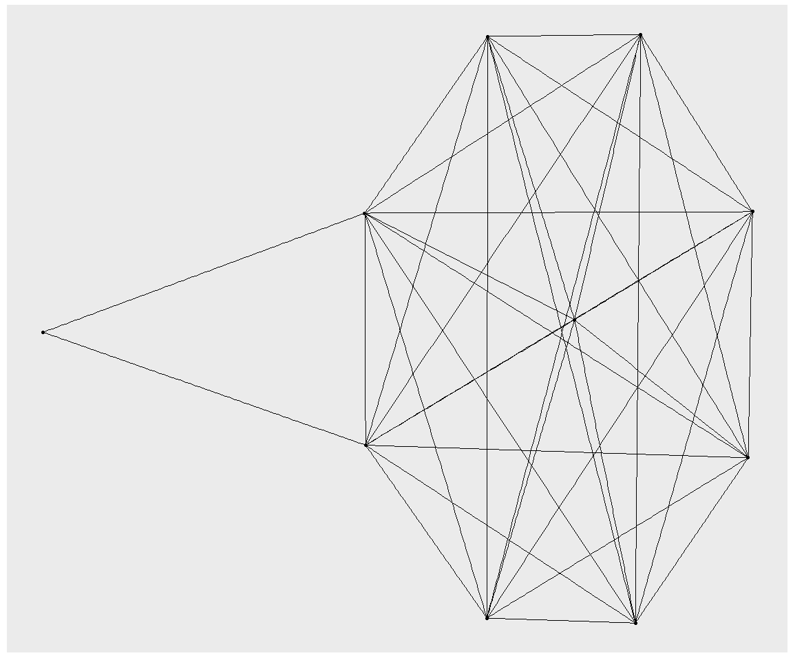
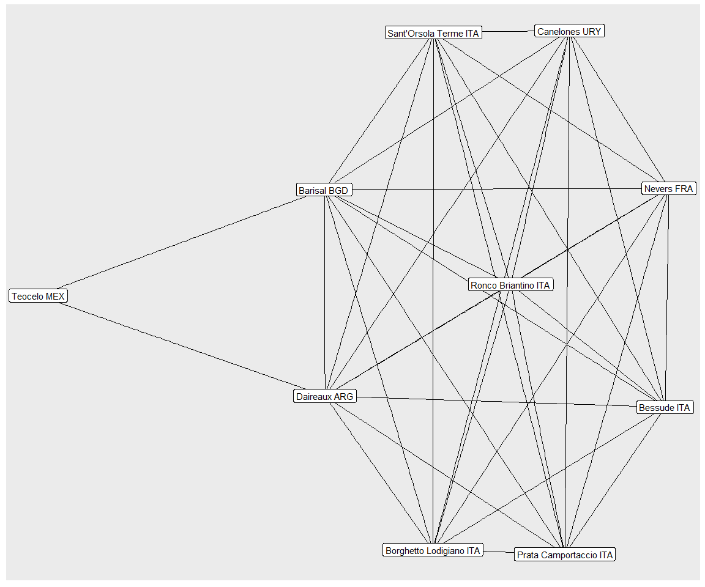
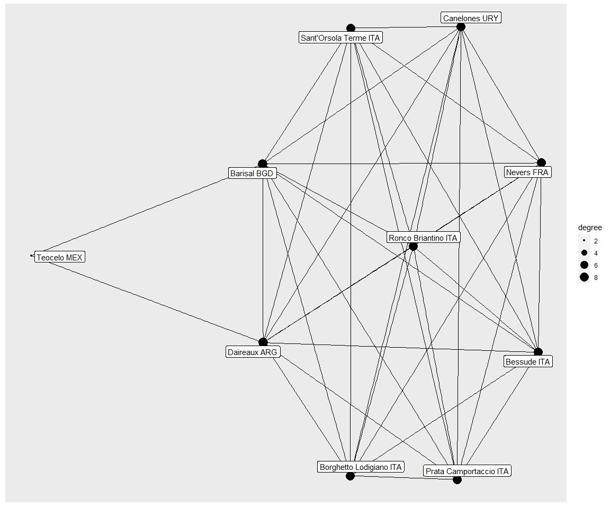
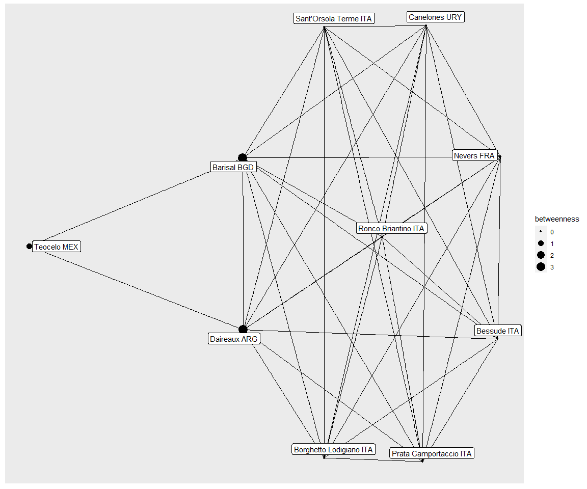
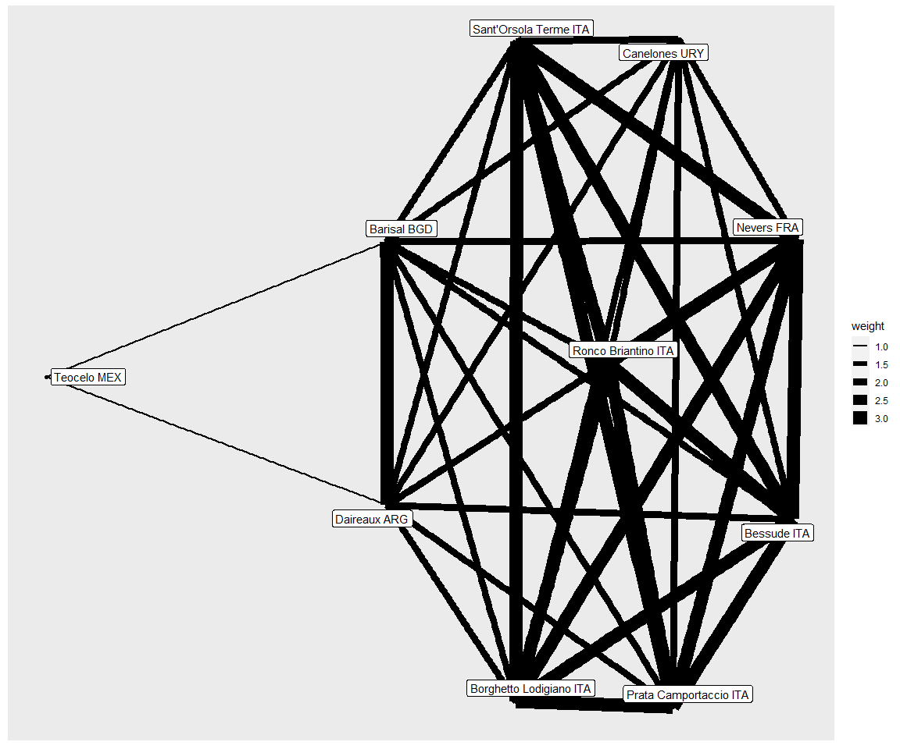
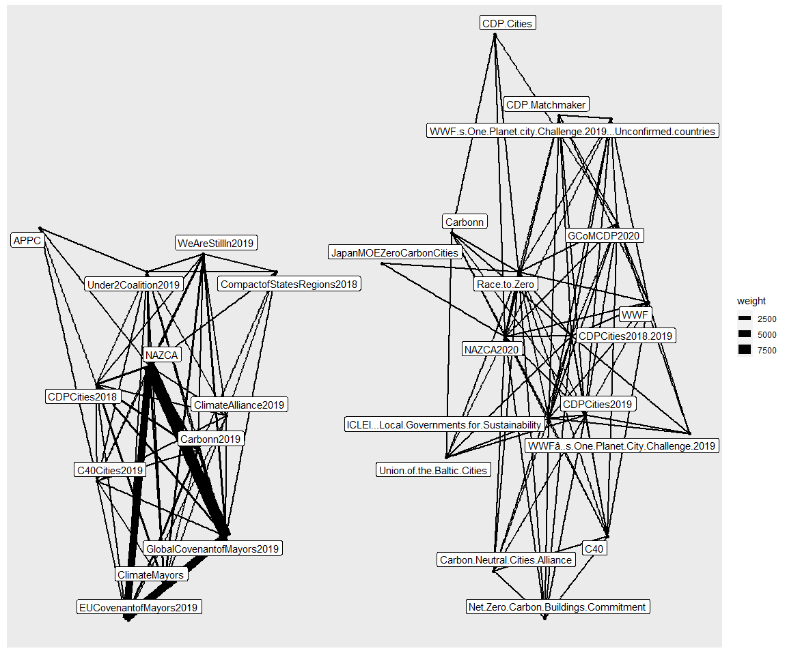

```r
knitr::opts_chunk$set(fig.width=12, fig.height=10) # we want nice and big figures to read our network maps, so just setting a figure width and height as a general setting here
```

# **Social Network Analysis for the Green Transition - Intro and Case Exercise**

### ClimActor

ClimActor is a harmonized transnational data on climate network participation by city and regional governments. It contains data on more than 10,000 city and regional governments participating in networks like the Global Covenant of Mayors for Climate and Energy, C40 Cities for Climate Leadership, ICLEI Local Leaders for Sustainability, among others. ClimActor includes key contextual information on each actor’s population, geographic location, and administrative jurisdiction to facilitate disambiguation of potential overlaps in actions or emissions. 

I have collected data from their outsource database, cleaned it up and made it available on GitHub. We will work with that below.

### Loading in data

For this example, we'll load in the ClimActor raw data from September 2020, which I have cleaned slightly to make it easier for us to work with. The data contains information on various organisational actors (cities etc.) and their sign-up to about 40 different climate initiatives.


```r
data = read.csv("https://raw.githubusercontent.com/phdskat/organisingglobalmarkets2022/main/climactor-clean-2020.csv",header=T,row.names=1 ) # we need headers and rownames for a network data structure, so we do that here
```

### Looking at the data


```r
View(data)
```

### Tidyverse

To manipulate the data, we'll load `tidyverse`


```r
library(tidyverse)
```

```
## -- Attaching packages --------------------------------------- tidyverse 1.3.1 --
```

```
## v ggplot2 3.3.3     v purrr   0.3.4
## v tibble  3.1.2     v dplyr   1.0.6
## v tidyr   1.2.0     v stringr 1.4.0
## v readr   1.4.0     v forcats 0.5.1
```

```
## -- Conflicts ------------------------------------------ tidyverse_conflicts() --
## x dplyr::filter() masks stats::filter()
## x dplyr::lag()    masks stats::lag()
```

### Data manipulation

To be able to work with the data from a network perspective, we have to do a couple different things:

First, we can can consider sampling from the total population of entities in the dataset, which encompasses more than 10.000 individual organisations/cities. That's hard to map at first, so we'll start with a sample of, say, 10 entities.


```r
# we'll save a new data frame called data2 with sample from our original dataframe

data2 = data %>% 

#  we "slice" the data, selecting a sample of, say, 10 rows (entities) to work with. For comparison's sake, we'll select the same 10 organisations that we can all work with. I chose these at random with the sample() function. You can play around with doing the analysis with other samples - larger samples, random samples, etc.

  slice(c(9180, 2856, 8236, 1144, 7290, 7750, 6244, 1305, 898, 1767))
```

Now we can work our data into a useful network structure, first by creating an adjacency matrix from our incidence matrix, which can be fed right into our network package of choice, `igraph`.

We can transform our existing data structure into an adjacency matrix with an operation called matrix multiplication. 


```r
adjacency <- as.matrix(data2) %*% t(as.matrix(data2))
```

Now we can look at the head of the adjacency matrix to see what it looks like:


```r
head(adjacency)
```

```
##                        Teocelo MEX Daireaux ARG Sant'Orsola Terme ITA
## Teocelo MEX                      1            1                     0
## Daireaux ARG                     1            3                     2
## Sant'Orsola Terme ITA            0            2                     3
## Bessude ITA                      0            2                     3
## Prata Camportaccio ITA           0            2                     3
## Ronco Briantino ITA              0            2                     3
##                        Bessude ITA Prata Camportaccio ITA Ronco Briantino ITA
## Teocelo MEX                      0                      0                   0
## Daireaux ARG                     2                      2                   2
## Sant'Orsola Terme ITA            3                      3                   3
## Bessude ITA                      3                      3                   3
## Prata Camportaccio ITA           3                      3                   3
## Ronco Briantino ITA              3                      3                   3
##                        Nevers FRA Borghetto Lodigiano ITA Barisal BGD
## Teocelo MEX                     0                       0           1
## Daireaux ARG                    2                       2           3
## Sant'Orsola Terme ITA           3                       3           2
## Bessude ITA                     3                       3           2
## Prata Camportaccio ITA          3                       3           2
## Ronco Briantino ITA             3                       3           2
##                        Canelones URY
## Teocelo MEX                        0
## Daireaux ARG                       2
## Sant'Orsola Terme ITA              2
## Bessude ITA                        2
## Prata Camportaccio ITA             2
## Ronco Briantino ITA                2
```
So what we see now is an adjacency matrix, indicating the number of inititaives that each of the entities shared with another entity. Now we can build our network from the adjacency matrix.

Note that we can reverse that matrix multiplication if we want to make the *initiatives* the nodes in our network, with the links by shared organisations, rather than what we have now, which is the *organisations* as nodes, with the links by shared initiative. You will do that later on in the exercise.

### Creating a simple network

Now we want to create, visualize and explore our network. To do so, we employ two packages: `igraph`, which is R's foremost network infrastructure. However, it creates - sorry to say - horrible visualizations that make it hard to intuitively grasp network structures. Instead, we use `ggraph`, which is the `ggplot` family's primary network visualization package - it follows the ggplot layered style which are you familiar with.

### Installing network libraries

If you haven't already installed these packages, do as follows:


```r
# install.packages("igraph")
# install.packages("ggraph")
```

### Loading  network libraries


```r
library(igraph)
library(ggraph)
```

### Creating a network object

The first thing we need to do so is to create a network object, something which structures the network with edges and vertices, links between them, weights and any other attributes. 

`igraph` has a handy function to create a network object from an adjacency matrix:


```r
network <- graph_from_adjacency_matrix(adjacency, 
                                       diag = FALSE, 
                                       mode = "undirected",
                                       weighted = TRUE)
```

### Plotting the network

Now we can follow the ggplot-style layering, using `ggraph` to create a simple network. 

The basic style for ggraph is similar to ggplot, first setting up the plot object, and then we add layers that give us the plot features we need. Here, we want to create a *node* layer (vertices), and an *edge* layer. There are multiple styles of visualizing nodes or edges, which largely follow the ggplot notation, so there's for instance a `geom_node_point()` layer, and a `geom_edge_link()` layer, which are simple in style. We'll use them here:


```r
ggraph(network) +
  geom_node_point() +
  geom_edge_link()
```

```
## Using `stress` as default layout
```

<!-- -->

Now we can add more layers, for instance adding labels to our nodes:


```r
ggraph(network) +
  geom_node_point() +
  geom_edge_link() +
  geom_node_label(aes(label=name, repel = T))
```

```
## Using `stress` as default layout
```

```
## Warning: Ignoring unknown aesthetics: repel
```

<!-- -->

### Calculating centrality measures

Now we can do some more advanced stuff. To understand the network's key players, we can calculate and apply basic measures of centrality in the network and visualize that. We can go back to the session slides to see what each of these things mean.

### Calculate and add degree centrality


```r
# calculating the degree centrality of each node in the network, and saving it in a 'degree' option

degree <- degree(network)

# visualizing our network, setting the 'size' aesthetic for nodes to reflect degree

ggraph(network) +
  geom_node_point(aes(size=degree)) +
  geom_edge_link() +
  geom_node_label(aes(label=name), repel = T)
```

```
## Using `stress` as default layout
```

<!-- -->

### Calculate and add betweenness centrality


```r
betweenness <- betweenness(network)

ggraph(network) +
  geom_node_point(aes(size=betweenness)) +
  geom_edge_link() +
  geom_node_label(aes(label=name), repel = T)
```

```
## Using `stress` as default layout
```

<!-- -->

### Calculate and visualize relationship tie strength (edge weight)


```r
ggraph(network) +
  geom_node_point() +
  geom_edge_link(aes(edge_width=weight)) +
  geom_node_label(aes(label=name), repel = T)
```

```
## Using `stress` as default layout
```

<!-- -->
  
# **Case Exercise**

Now we can try to flip it, focused on the projects/initiatives as nodes, with organisations as links.

With that, we have a fuller picture of the network here, with both the individuals' network and the initiatives' network.

These exercises you will run yourself in smaller groups, and then we will come back to discussion points outlined at the end of the document.

### Creating the initiative network

For the initiative network, we can use the full sample, as there are about 40 projects in the data set.

We follow the same procedure, first creating the adjacency matrix out of our indidence matrix, then creating the network object.


```r
adjacency2 <- t(as.matrix(data)) %*% as.matrix(data) # flip the matrix multiplication

# also to filter a cleaner map, let's remove projects with less than 5 links

network2 <- graph_from_adjacency_matrix(adjacency2, 
                                       diag = FALSE, 
                                       mode = "undirected",
                                       weighted = T)
```

### Plot the network


```r
ggraph(network2) +
  geom_node_point() +
  geom_edge_link() +
  geom_node_label(aes(label= name), repel = T)
```

```
## Using `stress` as default layout
```

```
## Warning: ggrepel: 2 unlabeled data points (too many overlaps). Consider
## increasing max.overlaps
```

<!-- -->

### Calculate and add degree and betweenness centrality measures


```r
degree2 <- degree(network2)
betweenness2 <- betweenness(network2)
```

Now this can be very messy, with a couple of different components and few links between some inititiaves, because, well, simply, they aren't that popular and so there are few organisations whose sign-up overlaps. To slim down the visual, we can remove some organisations - for instance those with less than 2 degree (links), and .


```r
network2 <- network2 %>% 
  delete.vertices(which(degree2<2))
```

Now we can visualize this, as a somewhat more meaningful network. To highlight connections, we can also add tie strength (edge/link weights):

### Calculate and visualize relationship tie strength (edge weight)


```r
ggraph(network2) +
  geom_node_point() +
  geom_edge_link(aes(edge_width=weight)) +
  geom_node_label(aes(label=name), repel = T)
```

```
## Using `stress` as default layout
```

<!-- -->

# **Discussions**

* What are the key features of these networks, in terms of structure, positions, relations?

* If you were leading a Copenhagen Municipality Climate plan, and you wanted to, say, find the most climate-progressive organisations to spar with, or the key initiatives to join, how would you do that?

* In other words, who are the key organisations and initiatives in the network to lobby/contact/connect with, based on centrality measures and network structure, and why?
